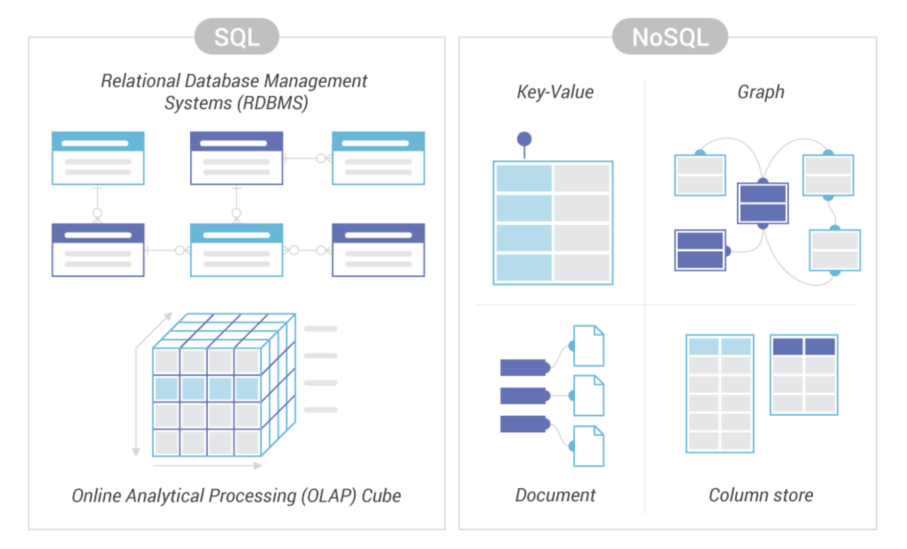
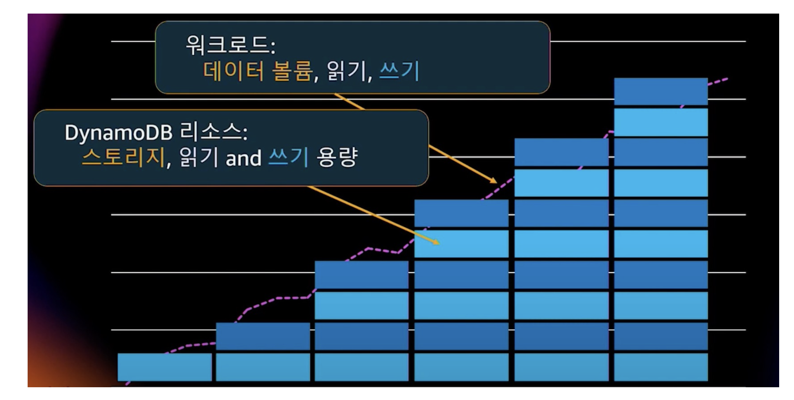
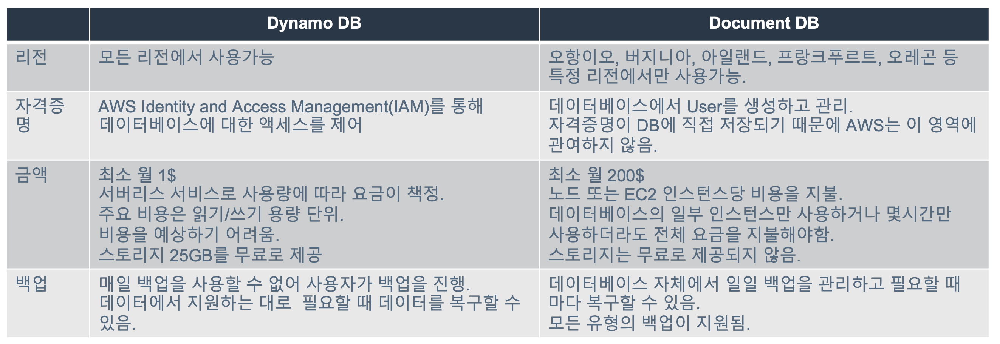

# 📚 AWS 

## 📖 DB

### SQL vs NoSQL

### RDS
- DB 인스턴스는 클라우드에서 실행하는 격리된 데이터베이스 환경

- DB 인스턴스는 여러 사용자가 만든 데이터베이스가 포함 될 수 있으며, 독립 실행형 데이터베이스 인스턴스에 액세스할 때 사용하는 도구 및 애플리케이션을 사용해 액세스 할 수 있다.

- AWS 명령줄 도구, Amazon RDS API 작업 또는 AWS Management Console을 사용해 간단히 DB 인스턴스를 만들고 수정 할 수 있다.

- 직접 시스템 로그인 불가능

- RDS는 serverless가 아님

### Document DB
- MongoDB API 워크로드의 완전 관리 및 유연한 확장이 가능한 문서전용 데이터베이스

- Amazone DocumentDB에서는 스토리지 및 컴퓨팅이 분리되어 각각을 독립적으로 조정

- 개발자는 데이터 크기에 관계없이 지연 시간이 짧은 일기 전용 복제본을 몇 분 내에 최대 15개까지 추가하여 읽기 용량을 초당 수백만 개의 요청으로 늘릴 수 있음

- Amazone DocumentDB는 99.99%의 가용성을 위해 설계되었으며 6개의 데이터 복사본을 3개의 AWS 가용 영역(AZ)에 복제

- JSON 데이터

- 유연한 인덱싱

### MongoDB
- MongoDB는 Document 지향 Database이다.

- 데이터 중복이 발생할 수 있지만, 접근성과 가시성이 좋다.

- 스키마 설계가 어렵지만, 스키마가 유연해서 Application의 요구사항에 맞게 데이터를 수용할 수 있다.

- 분산에 대한 솔루션을 자체적으로 지원해서 Scale-out이 쉽다.

- 확장시, Application을 변경하지 않아도 된다.

### Dynamo DB
- Amazone DynamoDB는 완전관리형 Key-Value 기반 NoSQL 데이터베이스 서비스

- Auto-Scaling

- DynamoDB는 유휴 시 암호화를 제공하여 중요한 데이터 보호와 관련된 우녕 부담 및 복잡성을 제거한다.

- DynamoDB를 통해 원하는 양의 데이터를 저장 및 검색하고 어느 수준의 요청 트래픽도 처리할 수 있는 데이터베이스 테이블을 생성할 수 있다.

- AWS Management Console을 사용하여 리소스 사용률 및 성능 지표를 모니터링 할 수 있다.

- DynamoDB는 온디맨드 백업 기능을 제공

- 테이블 생성시 스키마 생성 필요 없음

 

### Document DB vs Dynamo DB
- 공통점
    - NoSQL Database
    - AWS Database Migration Service를 통해 데이터 마이그레이션을 위한 이식성을 제공
    - AWS Key Managerment Service를 통한 저장 데이터 암호화와 보안기능을 제공
    - 관리 API 호출과 CloudFormation에 대한 CloudTrail 및 VPC Flow Logs 감사 기능 제공

 
