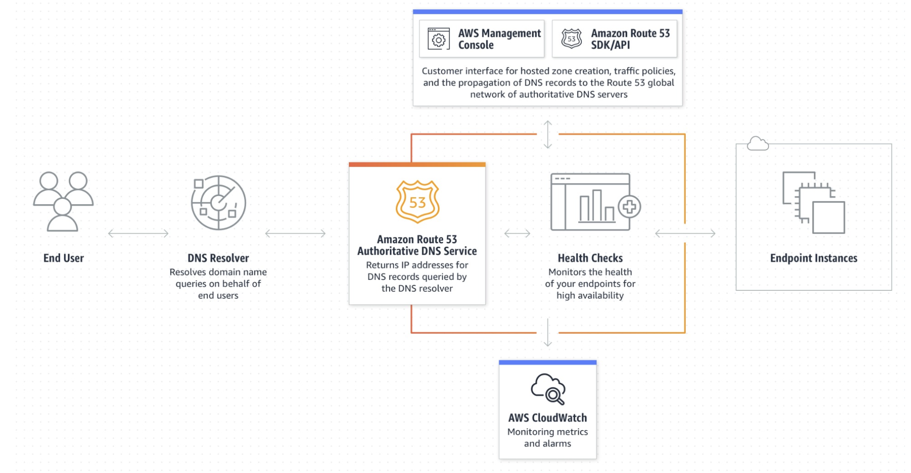

# 📚 AWS 

## 📖 Network

### Route53
- Amazon Route 53는 가용성과 확장성이 뛰어난 DNS 웹 서비스
- Route53을 사용하여 세 가지 주요 기능, 즉 도메인 등록, DNS 라우팅, 상태 확인을 조합하여 실행할 수 있다

### Route53 특징
- Route53은 public host zone과 private host zone 존재
- Route53 = DNS(네임서버) + 모니터링 + L4 + GSLB

### Certification Manager
- AWS Certificate Manager(ACM)를 사용하면 AWS 서비스 및 연결된 내부 리소스에 사용할 공인 및 사설 SSL/TLS 인증서를 프로비저닝 관리 및 배포를 할 수 있다.

- ACM은 SSL/TLS 인증서를 구매, 업로드 및 갱신하는 데 드는 시간 소모적인 수동 프로세스를 대신 처리해준다.

### Certification Manager 순서
1. 사용할 TLS/SSL 인증서를 AWS 계정으로 요청하거나 가져온다

2. DNS 또는 이메일 검증을 통해 요청된 인증서의 도메인 소유권을 검증하여 인증서 발급을 완료한다.

3. Elastic Load Balancing(ELB), Amazon CloudFront 등과 같은 다양한 AWS 서비스에서 새로 발급되거나 가져온 인증서를 사용한다.

### Certification Manager 특징
- ACM 통합 서비스를 위한 무료 퍼블릭 인증서

- 관리형 인증서 갱신

- 손쉽게 인증서 받기

#### SSL 인증서
- SSL 인증서는 공개 키와 개인 키라는 키 쌍을 갖고 있다.
- 이 키들이 함께 작용하여 암호화된 연결을 수립
- 인증서는 또한 "주체"라는 것을 포함하고 이는 인증서/웹사이트 소유자의 ID이다.
- 인증서를 얻으려면 서버에서 인증서 서명 요청(CSR)을 생성해야 한다.
- 이 과정에서 서버에 개인 키와 공개 키 생성
- SSL 인증서 발급자(인증 기관 또는 CA라 함)에게 보내는 CSR 데이터 파일에는 공개 키가 포함된다.

### CloudFront
- Amazon CloudFront는 뛰어난 성능, 보안 및 개발자 편의를 위해 구축된 콘텐츠 전송 네트워크(CDN) 서비스이다.

### CloudFront 특징
- 대기 시간 감소

- 보안 향상

- 비용 절감

- 사용자 정의 전송

#### CDN
1. 콘텐츠 전송 네트워크(CDN)는 데이터 사용량이 많은 애플리케이션의 웹 페이지 로드 속도를 높이는 상호 연결된 서버 네트워크
2. 정적 콘텐츠 & 동적 콘텐츠
3. 캐싱 / 동적 가속 / 엣지 로직 게산

### Elastic Load Balancing(ELB)
- 로드 밸런싱은 애플리케이션을 지원하는 리소스 풀 전체에 네트워크 트래픽을 균등하게 배포하는 방법

- 로드 밸런서는 서버에 가해지는 부하(=로드)를 분산(=밸런싱)해주는 장치 또는 기술을 통칭한다.

### ELB 대상그룹
- 대상 그룹에 대상을 등록한다

- 기본적으로 로드 밸런서는 대상 그룹에 대해 지정한 프로토콜과 포트 번호를 사용하여 등록된 대상으로 요청을 전송한다. 또는 대상 그룹에 각 대상을 등록할 때 이 포트를 재정의할 수 있다.

### VPC
- Amazon Virtual Private Cloud(Amazon VPC)를 이용하면 사용자가 정의한 가상 네트워크로 AWS 리소스를 시작할 수 있다.

- 이 가상 네트워크는 AWS의 확장 가능한 인프라를 사용한다는 이점과 함께 자체 데이터 센터에서 운영하는 기존 네트워크와 유사하다.

### VPC 기능
- Virtual Private Cloud(VPC)
    - VPC는 자체 데이터 센터에서 운영하는 기존 네트워크와 아주 유사한 가상 네트워크이다. VPC를 생성한 후 서브넷을 추가할 수 있다.

- 서브넷
    - 서브넷은 VPC의 IP 주소 범위이다. 서브넷은 단일 가용 영역에 상주해야 한다. 서브넷을 추가한 후에는 VPC에 AWS 리소스를 배포 할 수 있다.

- IP 주소 지정
    - VPC와 서브넷에 IPv4 주소와 IPv6 주소를 할당할 수 있다.
    - 퍼블릭 IPv4 및 IPv6 GUA 주소를 AWS로 가져오고 VPC의 리소스(예: EC2 인스턴스, NAT 게이트웨이, Network Load Balancer)에 할당할 수 있다.

- 라우팅
    - 라우팅 테이블을 사용하여 서브넷 또는 게이트웨이의 네트워크 트래픽이 전달되는 위치를 결정한다.

- 게이트웨이 및 엔드포인트
    - 게이트웨이는 VPC를 다른 네트워크에 연결한다.
    - 예를 들면, 인터넷 게이트웨이를 사용하여 VPC를 인터넷에 연결한다.
    - VPC 엔드포인트를 사용하여 인터넷 게이트웨이 또는 NAT 장치를 사용하지 않고 AWS 서비스에 비공개로 연결한다.

- 피어링 연결
    - VPC 피어링 연결을 사용하여 두 VPC의 리소스 간 트래픽을 라우팅 한다.

- 트래픽 미러링
    - 네트워크 인터페이스에서 네트워크 트래픽을 복사하고 심층 패킷 검사를 위해 보안 및 모니터링 어플라이언스로 전송한다.

- Transit Gateway
    - 중앙 허브 역할을 하는 전송 게이트웨이를 사용하여 VPC, VPN 연결 및 AWS Direct Connect 연결 간에 트래픽을 라우팅한다.

- VPC 흐름 로그
    - 흐름 로그는 VPC의 네트워크 인터페이스로 들어오고 나가는 IP 트래픽에 대한 정보를 캡쳐한다.

- VPN 연결
    - AWS VPN을 사용하여 온프레미스 네트워크에 VPC를 연결한다.

### VPC 생성

### Nat gateway

#### CIDR
- 클래스 없는 도메인 간 라우팅 기법