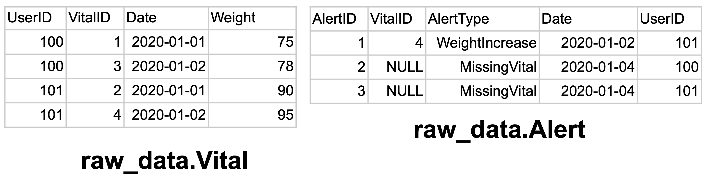
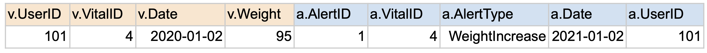
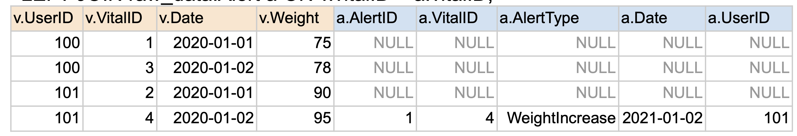
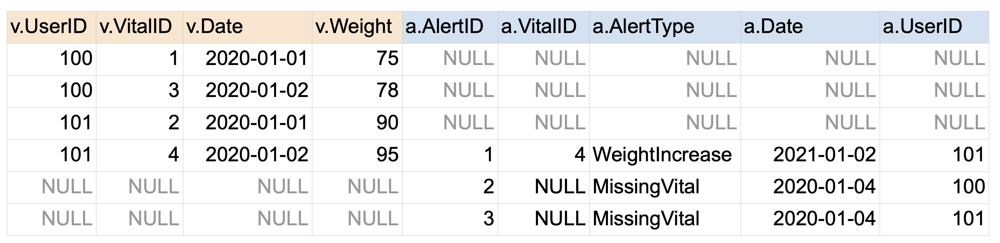
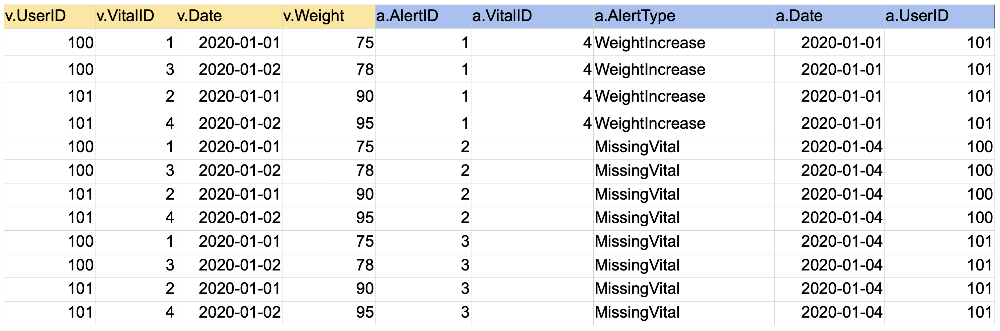
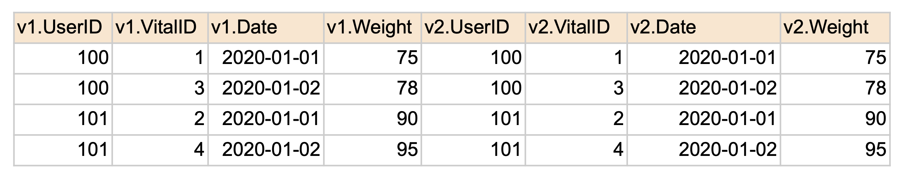

# 📚 JOIN 소개

## 📖 JOIN 이란?

### JOIN 이란?
- 두개 혹은 그 이상의 테이블들을 공통 필드를 가지고 머지하는데 사용된다.
- 이는 스타 스키마로 구성된 테이블들로 분산되어 있던 정보를 통합하는데 사용된다.


### JOIN시 고려해야할 점
- 중복 레코드가 없고 Primary Key의 uniqueness가 보장됨을 체크
- 조인하는 테이이블들간의 관계를 명확하게 정의
    - One to one, One to many, Many to one, Many to many
- 어느 테이블을 베이스로 잡을지 결정해야함

## 📖 다양한 종류의 JOIN

### 테이블 예시



### INNER JOIN
1. 양쪽 테이블에서 매치가 되는 레코드들만 리턴함
2. 양쪽 테이블의 필드가 모두 채워진 상태로 리턴됨

``` sql
SELECT * 
FROM raw_data.Vital v
JOIN raw_data.Alert a 
ON v.vitalID = a.vitalID;
```



### LEFT JOIN
1. 왼쪽 테이블의 모든 레코드들을 리턴함
2. 오른쪽 테이블의 필드는 왼쪽 레코드와 매칭되는 경우에만 채워진 상태로 리턴됨

``` sql
SELECT * 
FROM raw_data.Vital v
LEFT JOIN raw_data.Alert a 
ON v.vitalID = a.vitalID;
```



### FULL JOIN
1. 왼쪽 테이블과 오른쪽 테이블의 모든 레코드들을 리턴함
2. 매칭되는 경우에만 양쪽 테이블들의 모든 필드들이 채워진 상태로 리턴됨

``` sql
SELECT * 
FROM raw_data.Vital v
FULL JOIN raw_data.Alert a 
ON v.vitalID = a.vitalID;
```



### CROSS JOIN
1. 왼쪽 테이블과 오른쪽 테이블의 모든 레코드들의 조합을 리턴함

``` sql
SELECT * 
FROM raw_data.Vital v
CROSS JOIN raw_data.Alert a 
ON v.vitalID = a.vitalID;
```



### SELF JOIN
1. 동일한 테이블을 alias를 달리해서 자기 자신과 조인함

``` sql
SELECT * 
FROM raw_data.Vital v1
JOIN raw_data.Vital v2
ON v1.vitalID = v2.vitalID;
```

