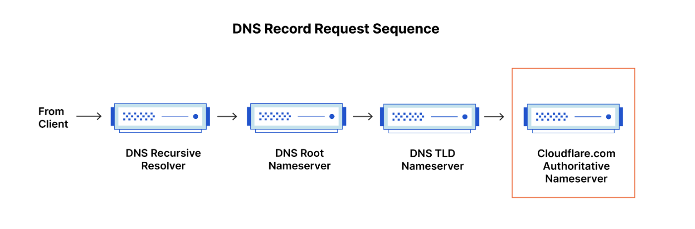
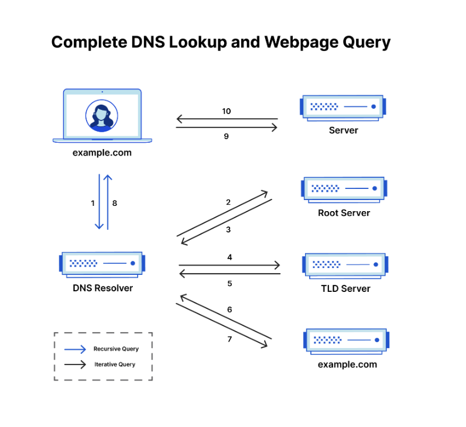

# 📚 DNS란 무엇인가?
- **도메인 이름 시스템(Domain Name System)**
- **사람이 읽을 수 있는 도메인 이름을 머신이이 읽을 수 있는 IP주소로 변환**
- **인터넷의 전화번호부**

## 📖 웹 페이지로드와 관련된 4개의 DNS 서버
- **DNS 리커서** : 도서관의 어딘가에서 특정한 책을 찾아달라고 요청한 사서와 비슷하다.
- **루트 이름 서버** : 도서관에서 책장 위치를 가리키는 색인과 비슷하다.
- **TLD 이름 서버** : 도서관의 특정 책장과 비슷하다.
- **권한 있는 이름 서버** : 최종 이름 서버로서, 책장에 있는 사전처럼 특정 이름을 해당 정의로 변환.

## 📖 권한 있는 DNS 서버와 재귀 DNS 확인자의 차이점
재귀 확인자는 DNS 쿼리의 시작 부분에 있고 권한 있는 이름 서버는 끝부분에 있다.

### 재귀 DNS 확인자
- 클라이언트의 재귀 요청에 응답하고 DNS 레코드를 추적하는 데 시간을 투자하는 컴퓨터
- 요청한 레코드에 대해, 권한있는 DNS 이름 서버에 도달할 때까지 일련의 요청을 하는 방식으로 이를 수행합니다.
- 캐싱은 DNS 조회 초기에, 요청한 자원 레코드를 제공하여 필요한 요청을 단락시키는 데 도움이 되는 데이터 지속성 프로세스입니다.

### 권한 있는 DNS 서버
- 실제로 DNS 리소스 레코드를 보유하고 담당하는 서버
- 쿼리한 자원 레코드로 응답하는 DNS 조회 체인의 맨 아래에 있는 서버
- 궁극적으로 웹 브라우저가 웹사이트 또는 다른 웹 자원에 액세스하는 데 필요한 IP 주소에 도달하도록 요청할 수 있게 한다.

하위 도메인에 대한 쿼리인 경우, 추가 이름 서버가 권한 있는 이름 서버 다음의 시퀀스에 추가되어 하위 도메인의 CNAME 레코드 저장을 담당한다

## 📖 DNS 조회는 어떤 단계를 거칩니까?

### DNS 조회의 8단계

1. 사용자가 웹 브라우저에 'example.com'을 입력하면, 쿼리가 인터넷으로 이동하고 DNS 재귀 확인자가 이를 수신

2. 확인자가 DNS 루트 이름 서버(.)를 쿼리

3. 루트 서버가, 도메인에 대한 정보를 저장하는 최상위 도메인(TLD) DNS 서버(예: .com 또는 .net)의 주소로 확인자에 응답, example.com을 검색할 경우의 요청은 .com TLD를 가리킨다.

4. 확인자가 .com TLD에 요청

5. TLD 서버가 도메인 이름 서버(example.com)의 IP 주소로 응답

6. 재귀 확인자가 도메인의 이름 서버로 쿼리를 전송

7. example.com의 IP 주소가 이름 서버에서 확인자에게 반환

8. DNS 확인자가, 처음 요청한 도메인의 IP 주소로 웹 브라우저에 응답

9. 브라우저가 IP 주소로 HTTP 요청을 전송

10. 해당 IP의 서버가 브라우저에게 랜더링할 웹 페이지를 반환

## 📖 DNS 확인자란 무엇입니까?
- DNS 조회의 첫 번째 중단점이며, 최초 요청을 한 클라이언트 처리를 담당
- 확인자는 URL이 궁극적으로 필요한 IP 주소로 변환되도록 하는 일련의 쿼리를 시작
- 재귀 쿼리를 수락하고 필요한 요청을 수행하는 방식으로 응답을 처리하는 컴퓨터

## 📖 DNS 쿼리에는 어떤 유형이 있습니까?

### 세 가지 유형의 DNS 쿼리

1. **재귀 쿼리** : DNS 리졸버가 최종 IP 주소를 찾을 때까지 대신 조회해주는 방식

2. **반복 쿼리** : 서버가 다음 조회 대상 서버 주소만 알려주고, 클라이언트가 직접 반복 조회하는 방식

3. **비재귀 쿼리** : 서버가 자신이 가진 캐시 정보만으로 즉시 응답하는 방식