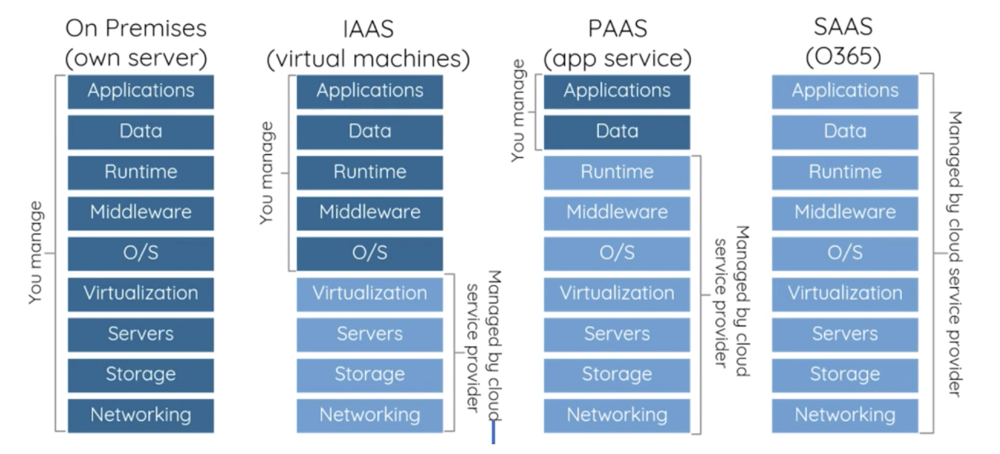

# 📚 AWS 

## 📖 클라우드 서비스

### AWS란?
- 전세계적으로 분포한 데이터 센터에서 200개가 넘는 완벽한 기능의 서비스를 제공하는, 세계적으로 가장 포괄적이며, 널리 채택되고 있는 클라우드 플랫폼
- 빠르게 성장하는 스타트업, 가장 큰 규모의 엔터프라이즈, 주요 정부 기관을 포함하여 수백만 명의 고객이 AWS 사용하여 비용을 절감하고, 민첩성을 향상시키고 더 빠르게 혁신함

### 클라우드 컴퓨팅이란?
- 클라우드 컴퓨팅 IT 리소스를 인터넷을 통해 온디맨드로 제공하고 사용한만큼만 비용을 지불하는 방식
- 물리적 데이터 센터와 서버를 구입, 소유 및 유지 관리하는 대신, AWS와 같은 클라우드 공급자로부터 필요에 따라 컴퓨팅 파워, 스토리지, 데이터베이스와 같은 기술 서비스에 액세스 한다.

### 클라우드 컴퓨팅 이점
- 민첩성
- 탄력성
- 비용절감
- On demand
- 관리 용이성

### 클라우드 유형

### AWS 기본용어
- 가상화
    - 물리적 컴퓨터 하드웨어를 보다 효율적으로 활용할 수 있도록 해주는 프로세스이며, 이는 클라우드 컴퓨팅의 기반을 제공하는 기술

- 가상머신
    - 가상 머신(VM)은 소프트웨어 형식으로 물리적 컴퓨팅을 시뮬레이션하는 가상 환경이다. 이들은 일반적으로 VM의 구성, 가상 하드 드라이브의 스토리지, 그리고 특정 시점에 해당 상태를 유지하는 VM의 일부 스냅샷을 포함한 다수의 파일들로 구성되어 있다.

- 스냅샷
    - 스냡샷을 마치 사진 찍듯이 특정 시점에 스토리지 파일 시스템을 포착해 보관하는 기술
    - Windows OS의 복원 지점과 같이 장애나 데이터 손상시 스냅샷을 생성한 시점으로 데이터를 복구
    - 스냅샷은 원본 데이터를 그대로 복사해 다른 곳에 저장하는 백업과 달리 초기 생성시 혹은 데이터의 변경이 있기 전까지는 스토리지의 공간을 차지하지 않는다.
    - 메타데이터(데이터에 대한 부가적인 정보)의 복사본에 해당하기 때문에 생성하는데 오랜 시간이 걸리지 않고, 장애 상황이 발생해도 빠르게 데이터를 복원

- Availability Zone(가용영역)
    - 하나의 Region은 두 개 이상의 Availability Zone으로 구성됨
    - 줄여셔 AZ로 표시

