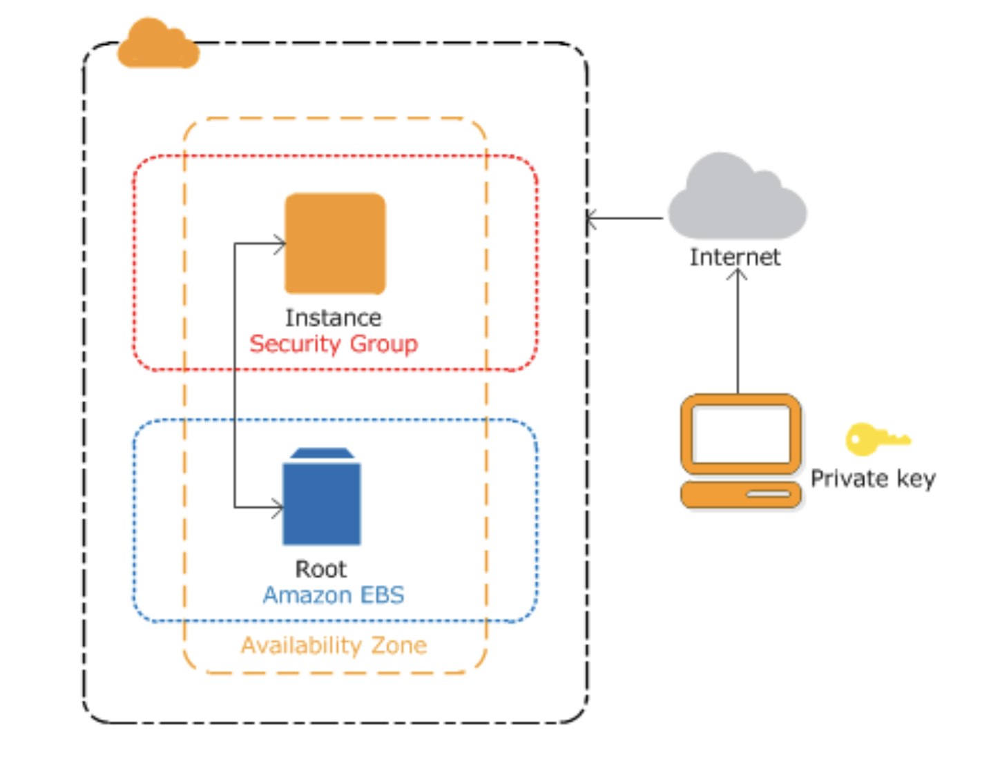

# 📚 AWS 

## 📖 EC2

### AWS EC2 기능
- 인스턴스
    - 가상 컴퓨팅 환경

- Amazon 머신 이미지(AMI)
    - 서버에 필요한 운영체제와 여러 소프트웨어들이 적절히 구성된 상태로 제공되는 템플릿으로 인스턴스를 쉽게 만들 수 있다.

- 인스턴스 유형
    - 인스턴스를 위한 CPU, 메모리, 스토리지, 네트워킹 용량의 여러 가지 구성 제공

- 키페어를 사용하여 인스턴스 로그인 정보 보호
    - AWS는 퍼블릭 키를 저장하고 사용자는 개인 키를 안전한 장소에 보관하는 방식

- 인스턴스 스토어 볼륨
    - 임시 데이터를 저장하는 스토리지 볼륨으로 인스턴스 중단, 최대 절전 모드로 전화 또는 종료 시 삭제됨

- Amazone Elastic Block Store(Amazone EBS)
    - Amazone EBS 볼륨을 사용해 영구 스토리지 볼륨에 데이터 저장

- 보안 그룹을 사용해 인스턴스에 연결할 수 있는 프로토콜, 포트, 소스 IP 범위를 지정하는 방화벽 기능

- 탄력적 IP 주소(EIP)
    - 동적 클라우드 컴퓨팅을 위한 고정 IPv4 주소

- 태그
    - 사용자가 생성하여 Amazone EC2 리소스에 할당할 수 있는 메타 데이터

- Virtual Private Clouds(VPC)
    - AWS 클라우드에서는 논리적으로 격리되어 있지만 원할 때마다 고객의 네트워크와 간편히 연결할 수 있는 가상 네트워크

### AWS EC2 구성도

### Elasticbeanstalk
- Elastic Beanstalk를 사용하면 애플리케이션을 실행하는 인프라에 대해 자세히 알지 못해도
AWS 클라우드에서 애플리케이션을 신속하게 배포하고 관리할 수 있다.

- Elastic Beanstalk를 사용하면 선택 또는 제어에 대한 제한 없이 관리 복잡성을 줄일 수 있다.
애플리케이션을 업로드하기만 하면 Elastic Beanstalk에서 용량 프로비저닝, 로드 밸런싱, 조정, 애플리케이션 상태 모니터링에 대한 세부 정보를 자동으로 처리한다.

- Elastic Beanstalk는 Go, Java, .NET, Node.js, PHP, Python 및 Ruby에서 개발된 애플리케이션을 지원한다.
애플리케이션을 배포할 때, Elastic Beanstalk가 선택된 지원 가능 플랫폼 버전을 구축하고
Amazon EC2 등의 AWS 리소스를 하나 이상 프로비저닝하여 애플리케이션을 실행한다.