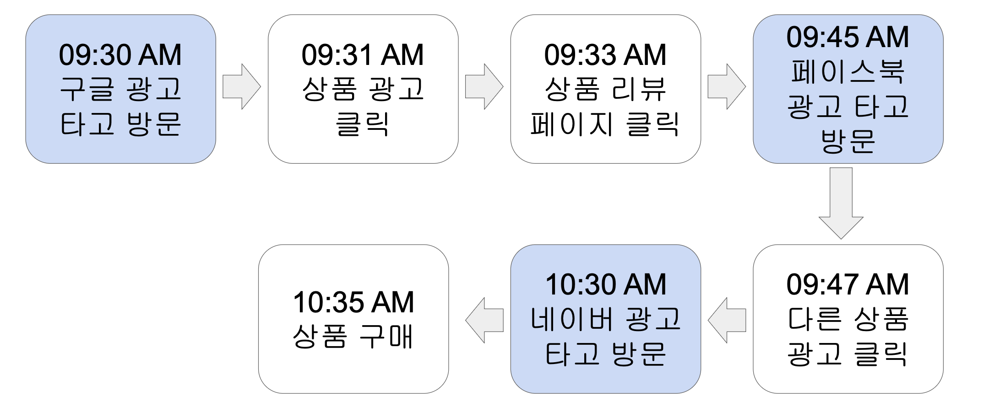
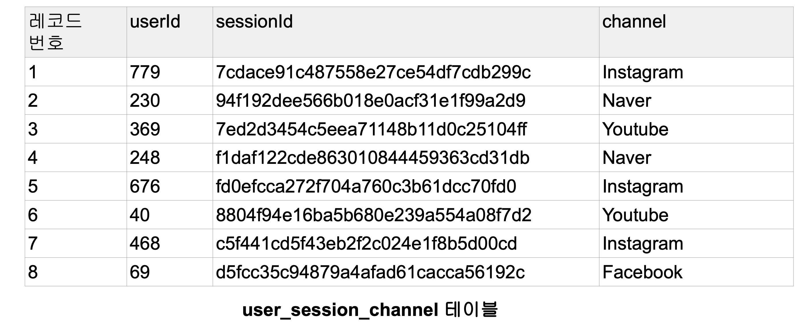
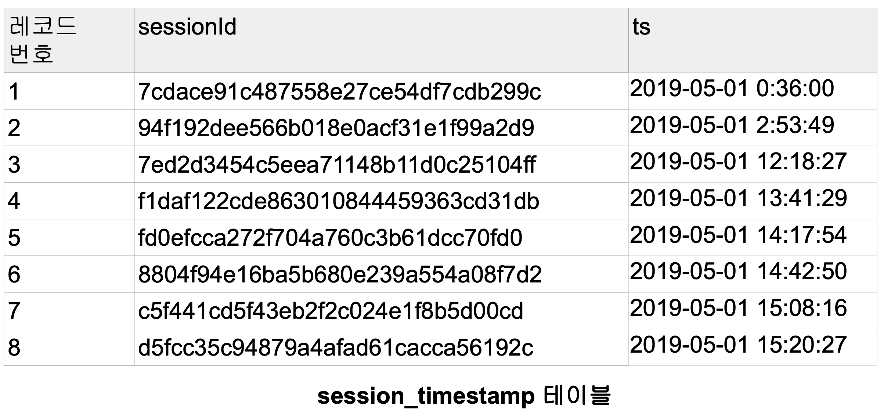

# 📚 SELECT 배우기

## 📖 예제 테이블

### 관계형 데이터베이스 예제 - 웹서비스 사용자/세션 정보
- 사용자 ID = 사용자마다 부여하는 유일한 ID

- 세션 ID = 세션마다 부여되는 ID
    - 세션 : 사용자의 방문을 논리적인 단위로 나눈 것
        - 사용자가 외부 링크를 타고 오거나 직접 방문한 경우 세션 생성
        - 사용자가 방문 후 30분간 interaction이 없다가 뭔가 하는경우 세션 생성
    - 즉 하나의 사용자는 여러개의 세션을 가질 수 있다.
    - 보통 세션의 경우 세션을 만들어낸 접점을 채널이란 이름으로 기록해둠
        - 마케팅 관련 기여도 분석을 위함
    - 또한 세션이 생긴 시간도 기록

- 이 정보를 기반으로 다양한 데이터 분석과 지표 설정이 가능
    - 마케팅 관련, 사용자 트래픽 관련
    - DAU,WAU,MAU 등의 일주일별 Active User 차트
    - Marketing Channel Attribution 분석
        - 어느 채널에 광고를 하는 것이 효과적일까?

- 사용자 ID : 총 3개의 세션을 갖는 에제



### 관계형 데이터베이스 예제 - 데이터베이스와 테이블


<br>


## 📖 SQL 소개

### SQL 기본
- 다수의 SQL을 실행한다면 세미콜론 분리 필요
- SQL 주석 : --, /* */
- SQL 키워드는 대문자를 사용한다던지 하는 포맷팅이 필요
- 테이블/필드 이름의 명명규칙을 정하는 것이 중요
    - 단수형 vs 복수형
    - _ vs CamelCasing

### SQL DDL
- CREATE TABLE
    - Primary key 속성을 지정할 수 있으나 무시됨
        - Primary key uniqueness
            - 데이터 웨어하우스는 지켜지지 않음
    - CTAS: CREATE TABLE table_name AS SELECT
        - vs CREATE TABLE and then INSERT

- DROP TABLE
    - DROP TABLE table_name (없는 테이블을 삭제하면 에러)
    - DROP TABLE IF EXISTS table_name (없는 테이블을 삭제해도 에러 X)
    - DELECTE FROM
        - 조건에 맞는 레코드들을 지움(테이블 자체는 존재)

- AFTER TABEL
    - 새로운 컬럼 추가:
        - ALTER TABLE 테이블이름 ADD COLUMN 필드이름 필드 타입;
    - 기존 컬럼 이름 변경:
        - ALTER TABLE 테이블이름 RENAME 현재필드이름 to 새필드이름;
    - 기존 컬럼 제거:
        - ALTER TABLE 테이블이름 DROP COLUMN 필드 이름;
    - 테이블 이름 변경:
        - ALTER TABLE 현재테이블이름 RENAME to 새테이블이름;

### SQL DML
- 레코드 질의 언어 : SELECT
    - SLECT FROM : 테이블에서 레코드와 필드를 읽어오는데 사용
    - WHERE를 사용해서 레코드 선택 조건을 지정
    - GROUP BY를 통해 정보를 그룹 레벨에서 뽑는데 사용하기도 함
        - DAU, WAU, MAU 계산은 GROUP BY를 필요로 함
    - ORDER BY를 사용해서 레코드 순서를 결정하기도 함
    - 보통 다수의 테이블의 조인해서 사용하기도 함

- 레코드 수정 언어 :
    - INSERT FROM : 테이블에 레코드를 추가하는데 사용
    - UDATE FROM : 테이블 레코드의 필드 값 수정
    - DELETE FROM : 테이블에서 레코드를 삭제
        - vs TRUNCATE

## 📖 SQL 실습

### 실습에 들어가기에 앞서 기억할 점
- 현업에서 깨끗한 데이터란 존재하지 않음
    - 항상 데이터를 믿을 수 있는지 의심할 것
    - 실제 레코드를 몇 개 살펴보는 것 만한 것이 없다.

- 데이터 일을 한다면 항상 데이터의 품질을 의심하고 체크하는 버릇 필요
    - 중복된 레코드들 체크하기
    - 최근 데이터의 존재 여부 체크하기(freshness)
    - Primary eky uniqueness가 지켜지는지 체크하기
    - 값이 비어있는 컬럼들이 있는지 체크하기

- 어느 시점이 되면 너무나 많은 테이블들이 존재하게 됨
    - 중요 테이블들이 무엇이고 그것들의 메타 정보를 잘 관리하는 것이 중요해짐

- 그 시점부터는 Data Discovery 문제들이 생겨남

## 📖 SELECT 소개

### SELECT
- 테이블에서 레코드들을 읽어오는데 사용
- WHERE를 사용해 조건을 만족하는 레코드

### CASE WHEN
- 필드 값의 변환을 위해 사용 가능
    - CASE WHEN 조건 THEN 참일때 값 ELSE 거짓일때 값 END 필드이름
- 여러 조건을 사용하여 변환하는 것도 가능

``` sql
SELECT
    CASE
        WHEN channel in ('Facebook','Instagram') THEN 'Social-Media'
        WHEN channel in ('Google','Naver') THEN 'Search-engine'
        ELSE 'Something-Else'
    END channel_type
FROM raw_data.user_session_channel;
```

### NULL이란?
- 값이 존재하지 않음을 나타내는 상수. 0 혹은 ""과는 다름
- 필드 지정시 값이 없는 경우 NULL로 지정 가능
    - 테이블 정의시 디폴트 값으로도 지정 가능
- 어떤 필드의 값이 NULL인지 아닌지 비교는 특수한 문법을 필요로 함
    - field1 is NULL 혹은 field1 is no NULL
- NULL이 사칙연산에 사용되면 어떻게 될까?
    - 무조건 NULL이 나온다

### COUNT 함수 제대로 이해하기
Value 데이터 : NULL, 1, 1, 0, 0, 4, 3
- SELECT COUNT(1) = 7
- SELECT COUNT(0) = 7
- SELECT COUNT(NULL) = 0
- SELECT COUNT(value) = 6
- SELECT COUNT(DISTINCT value) = 4

### WHERE
- IN
- LIKE and ILIKE
    - LIKE is a case sensitive string match. ILIKE is a case-insensitive string match
    - LIKE 'G%' = 'G*'
- BETWEEN
- 위에 오퍼레이터들은 CASE WHEN 사이에도 사용 가능

### STRING Functions
- LEFT(str,N) :	문자열 str의 왼쪽부터 N글자를 반환
- REPLACE(str, exp1, exp2) : 문자열 str에서 exp1을 exp2로 치환
- UPPER(str) : 문자열 str을 대문자로 변환
- LOWER(str) : 문자열 str을 소문자로 변환
- LEN(str) : 문자열 str의 **길이(문자 수)**를 반환
- LPAD(str, N, pad) : 문자열 str의 왼쪽에 pad 문자를 채워 총 N글자로 만듦
- RPAD(str, N, pad) : 문자열 str의 오른쪽에 pad 문자를 채워 총 N글자로 만듦
- SUBSTRING(str, start, length) : 문자열 str에서 start 위치부터 length글자 잘라냄

### ORDER BY
- Default ordering is ascending
    - ORDER BY 1 ASC
- Descending requires "DESC"
    - ORDER BY 1 DESC
- Ordering by multiple columns:
    - ORDER BY 1 DESC, 2, 3
- NULL 값 순서는?
    - NULL 값들은 오름차순 일 경우(ASC), 마지막에 위치함
    - NULL 값들은 내림차순 일 경우(DESC), 처음에 위치함
    - 이를 바꾸고 싶다면 NULLS FIRST 혹은 NULLS LAST를 사용

### 타입 변환
- DATE Conversion
    - 타임존 관련 변환
        - CONVERT_TIMEZONE('America/Los_Angeles'. ts)
    - DATE, TRUNCATE
    - DATE_TRUNC : 첫번째 인자가 어떤 값을 추출하는지 지정
    - EXTRACT or DATE_PART : 날짜시간에서 특정 부분의 값을 추출가능
    - DATEDIFF
    - DATEADD
    - GETDATE

- TO_CHAR, TO_TIMESTAMP

### Type Casting
- 1/2의 결과는?
    - 0이 됨. 정수간의 연산은 정수가 되어야하기 때문
        - 분자나 분모 중의 하나를 float로 캐스팅해야 0.5가 나옴
        - 이는 프로그래밍 언어에서도 동일
- 오퍼레이터를 사용
    - category::float
- cast 함수를 사용
    - cast(category as float)