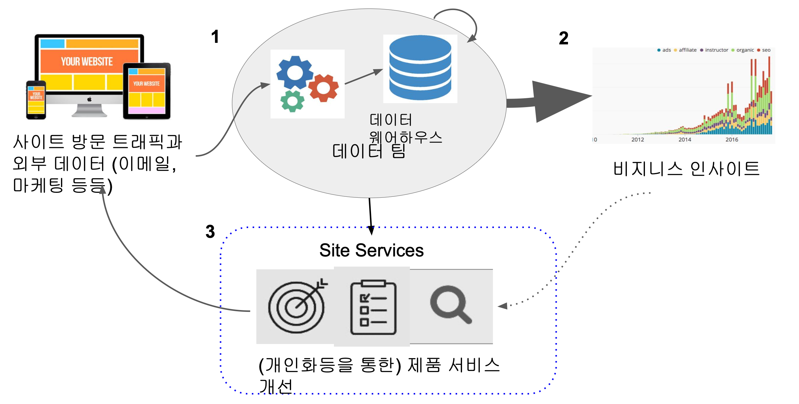

# 📚 SQL과 데이터베이스 기초 및 실전

## 📖 데이터 직군과 SQL의 중요성

SQL은 데이터베이스와 직접적으로 상호작용하는 언어로, 데이터 관련 직군이라면 반드시 능숙하게 다룰 수 있어야 한다.

### 주요 데이터 직군 및 역할

- **데이터 엔지니어**: 대규모 데이터 처리 파이프라인 구성 (ETL/ELT, Spark, Airflow 등)
- **데이터 분석가**: SQL 기반 분석 및 지표 도출, A/B 테스트 수행
- **데이터 과학자**: SQL을 통한 데이터 전처리 및 모델 학습용 데이터 구축

> 실무에서의 데이터 처리, 분석, 시각화, 머신러닝 모두 SQL을 기반으로 출발한다.

---

## 📖 관계형 데이터베이스 개요

### 정의 및 특징

- 관계형 데이터베이스(RDBMS)는 데이터를 테이블 형태로 저장하며, 각 테이블은 행과 열로 구성된다.
- SQL을 통해 데이터 정의(DDL), 조작(DML), 제어(DCL)가 가능하다.
- **정규화**를 통해 데이터 중복을 최소화하고 무결성을 보장하며, 실무에서는 읽기 성능을 위해 **부분 비정규화**를 선택하는 경우도 많다.

### OLTP vs OLAP

- **OLTP**  
  - 빠른 실시간 처리 목적, 정규화된 구조, INSERT/UPDATE 중심  
  - MySQL, PostgreSQL, Oracle 등

- **OLAP**  
  - 대규모 분석 목적, 비정규화된 구조, SELECT 중심  
  - Redshift, BigQuery, Snowflake 등

---

## 📖 SQL이란?

- SQL은 관계형 데이터베이스와 소통하기 위한 표준 언어이다.
- 데이터 생성, 조회, 수정, 삭제 및 권한 제어까지 모든 작업을 수행한다.
- ANSI/ISO 표준이 있으며, 대부분의 RDBMS는 이를 기반으로 확장 문법을 제공한다.

---

## 📖 데이터 모델링 및 스키마 설계

### 데이터 모델의 구성 요소

- **엔터티**: 테이블
- **속성**: 컬럼
- **관계**: 외래 키를 통한 연결

### 스키마 구조

- **스타 스키마**  
  - 중심에 팩트 테이블, 주변에 다수의 디멘션 테이블  
  - OLAP에서 널리 사용됨  
  

- **디노멀라이즈 스키마**  
  - 조인을 줄이고 쿼리 속도를 높이기 위해 하나의 테이블에 데이터를 통합  
  - 저장 공간은 증가하지만 조회 성능이 뛰어남  
  

---

## 📖 데이터 웨어하우스

- 대규모 분석 및 리포트용으로 설계된 시스템이며, 실시간 처리보다는 대용량 데이터 조회와 통계 분석에 최적화되어 있다.
- 데이터 정합성보다는 **속도와 확장성**이 우선되며, **파티셔닝**, **클러스터링**, **머터리얼라이즈 뷰** 등의 기술을 적극 활용한다.

### 주요 플랫폼

- AWS Redshift
- Google BigQuery
- Snowflake

<div style="display: flex; justify-content: center; gap: 20px;">
  
  
</div>

---

## 📖 SELECT와 기본 SQL

- `SELECT` 구문은 SQL의 핵심이며, 데이터 조회, 필터링, 정렬, 변형 등을 수행한다.
- 실무에서는 `CASE WHEN`, `COALESCE`, `NULLIF`, `CAST`, `ROUND` 등의 구문도 자주 사용된다.
- SQL에서 `NULL`은 "값이 없음"을 의미하며, 반드시 `IS NULL`, `IS NOT NULL`로 처리해야 한다.

---

## 📖 SQL DDL / DML 요약

- **DDL**: `CREATE`, `ALTER`, `DROP`
- **DML**: `SELECT`, `INSERT`, `UPDATE`, `DELETE`

테이블 설계 시 다음 제약 조건을 적절히 사용하는 것이 중요하다:
- `PRIMARY KEY`, `UNIQUE`, `NOT NULL`, `CHECK`, `DEFAULT`  
또한, **인덱스(INDEX)** 는 성능을 좌우하는 핵심 요소로, WHERE 절이나 JOIN에 자주 쓰이는 컬럼에 적용하는 것이 일반적이다.

---

## 📖 GROUP BY와 집계 함수

- 데이터를 기준 컬럼으로 그룹화하여 집계값을 계산할 수 있다.
- `GROUP BY`와 함께 사용되는 집계 함수: `COUNT`, `SUM`, `AVG`, `MAX`, `MIN`, `LISTAGG`

---

## 📖 CTAS / CTE / 데이터 품질 체크

- **CTAS**: `CREATE TABLE ... AS SELECT ...`로 임시 또는 결과 테이블 생성
- **CTE**: `WITH ... AS (...) SELECT ...` 구문으로 쿼리의 재사용 및 가독성 향상  
- 중복, NULL, 기본키 위반 여부 등의 검증 로직을 통해 데이터 품질을 지속적으로 점검해야 한다.  
※ 일부 RDBMS에서는 CTE가 내부적으로 임시 테이블로 처리되어 성능에 영향을 줄 수 있음

---

## 📖 JOIN 문법과 종류

- 조인은 여러 테이블 간의 관계를 기반으로 데이터를 병합하는 방식이다.  
- 종류: `INNER JOIN`, `LEFT JOIN`, `FULL OUTER JOIN`, `CROSS JOIN`, `SELF JOIN`

```md
- 성능 향상을 위해 조인 조건에 인덱스가 있는지 확인하고, 조인 대상 테이블의 크기를 고려한 쿼리 최적화가 필요하다.
```

---

## 📖 트랜잭션과 무결성

- 트랜잭션은 논리적 작업 단위이며, `BEGIN`, `COMMIT`, `ROLLBACK`으로 관리한다.
- 트랜잭션은 **ACID 속성**을 보장한다.

### 트랜잭션 격리 수준

- **READ UNCOMMITTED**: 다른 트랜잭션의 변경 내용을 읽을 수 있음 (Dirty Read)
- **READ COMMITTED**: 커밋된 데이터만 읽음 (기본값)
- **REPEATABLE READ**: 반복 조회 시 일관성 보장
- **SERIALIZABLE**: 가장 엄격한 격리, 완전한 동시성 제어

---

## 📖 고급 SQL 문법

- **집합 연산자**: `UNION`, `INTERSECT`, `EXCEPT`
- **윈도우 함수**: `ROW_NUMBER`, `LAG`, `RANK`, `FIRST_VALUE`, `SUM() OVER(...)`
- **문자열 처리**: `CONCAT`, `REPLACE`, `SUBSTRING`
- **타입 캐스팅**: `CAST(col AS type)`, `col::type`
- **날짜/시간 함수**: `DATE_TRUNC`, `EXTRACT`, `NOW()`
- **JSON 처리**: `json_extract_path_text`, `jsonb_array_elements`

### 실행 계획 (EXPLAIN)

복잡한 쿼리는 `EXPLAIN` 또는 `EXPLAIN ANALYZE`를 통해 실행 계획을 확인하고,
- 테이블 스캔 vs 인덱스 스캔
- 쿼리 병렬 처리 여부
- 조인 방식 (Nested Loop, Hash Join 등)  
을 분석하여 성능을 최적화해야 한다.

---

💡 단순 문법 암기보다, 실제 데이터셋으로 다양한 쿼리를 작성하고 성능을 튜닝하며 결과를 해석하는 경험이 SQL 실력을 결정짓는다.
