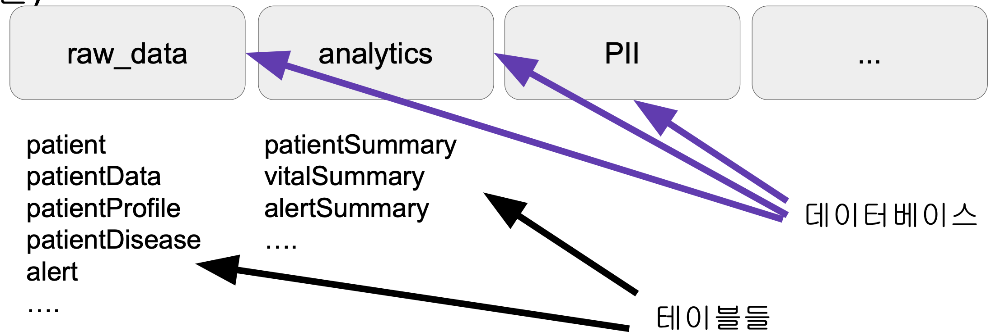
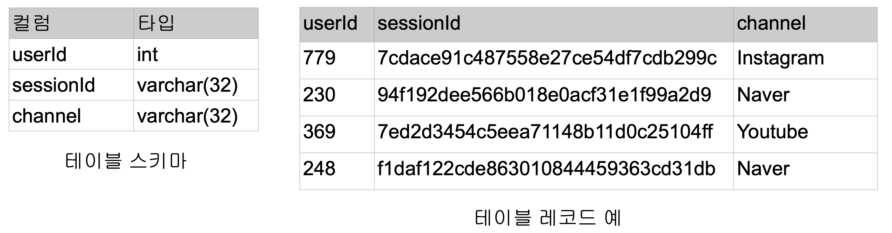
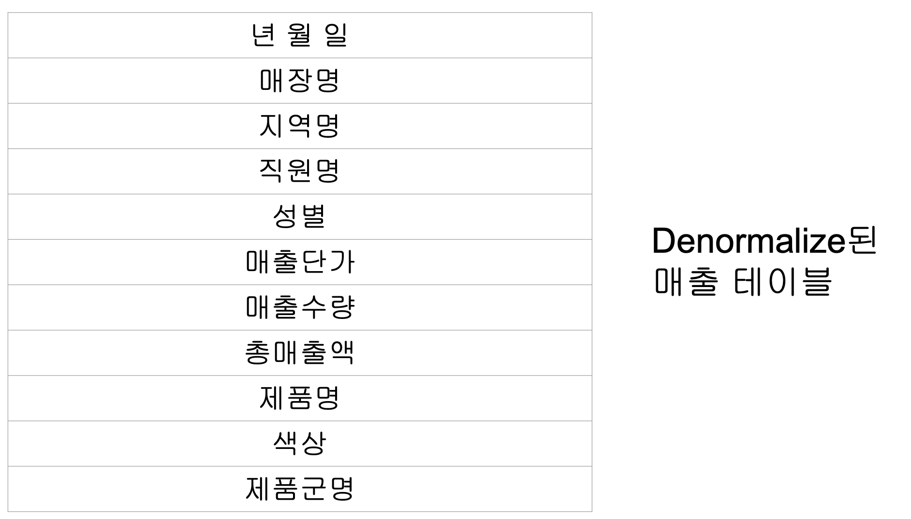
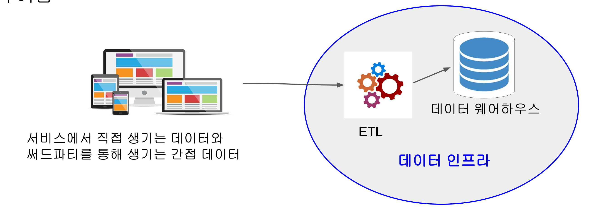
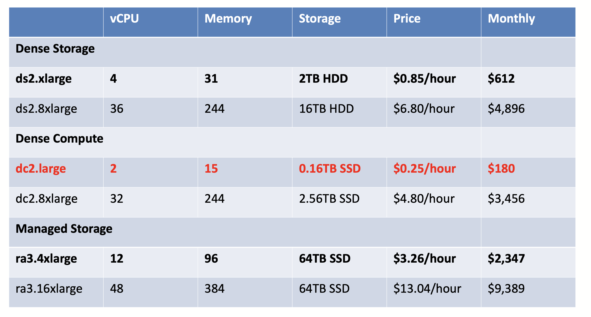

# 📚 SQL과 데이터베이스 소개

## 📖 SQL의 중요성

### 데이터 관련 3개의 직군
- 데이터 엔지니어:
    - 파이썬, 자바/스칼라
    - SQL, 데이터베이스
    - ETL, ELT(Airflow, DBT)
    - Spark, Hadoop

- 데이터 분석가:
    - SQL, 비지니스 도메인에 대한 지식
    - 통계 (AB 테스트 분석)

- 데이터 과학자
    - 머신러닝
    - SQL, 파이썬
    - 통계

**데이터 요약과 데이터 분석을 위한 SQL**

## 📖 관계형 데이터베이스란?

### 관계형 데이터베이스
- 구조화된 데이터를 저장하고 질의할 수 있도록 해주는 스토리지
- 관계형 데이터베이스를 조작하는 프로그래밍 언어가 ㄴ삐
    - 테이블 정의를 위한 DDL
    - 데이터 조작/질의를 위한 DML

### 대표적 관계형 데이터베이스
- 프로덕션 데이터베이스 : MYSQL, PostgreSQL
    - OLTP
    - 빠른속도에 집중. 서비스에 필요한 정보 저장

- 데이터 웨어하우스 : Redshift, Snowflake, BigQuery
    - OLAP
    - 처리 데이터 크기에 집중. 데이터 분석 혹은 모델 빌딩등을 위한 데이터 저장
        - 보통 프로덕션 데이터베이스를 복사해서 데이터 웨어하우스에 저장

### 관계형 데이터베이스의 구조
- 관계형 데이터베이스는 2 단계로 구성됨
    - 가장 밑단에는 테이블들이 존재
    - 테이블들은 데이터베이스라는 폴더 밑으로 구성

### 관계형 데이터베이스 구조

## 📖 SQL이란?

### SQL 소개
- SQL : 관계형 데이터베이스에 있는 데이터를 질의하거나 조작해주는 언어
- DDL, DML 언어로 구성됨

### SQL은 빅데이터 세상에서도 중요
- 구조화된 데이터를 다루는한 SQL은 데이터 규모와 상관없이 쓰임
- 모든 대용량 데이터 웨어하우스는 SQL 기반
- Spark나 Hadoop도 예외는 아님
- 데이터 분야에서 일하고자 하면 반드시 익혀야 한다.

### SQL의 단점
- 구조화된 데이터를 다루는데 최적화가 되어있음
    - 정규표현식을 통해 비구조화된 데이터를 어느 정도 다루는 것은 가능하나 제약이 심함

    - 많은 관계형 데이터베이스들이 플랫한 구조만 지원한 (no nested like JSON)
        - 구글 빅쿼리는 nested structer를 지원함

    - 비구조화된 데이터를 다루는데 Spark, Hadoop과 같은 분산 컴퓨팅 환경이 필요해짐
        - 즉 SQL만으로는 비구조화된 데이터를 처리하지 못함

- 관계형 데이터베이스마다 SQL 문법이 조금씩 상이

### Star schema
- Production DB용 관계형 데이터베이스에서는 보통 스키마를 사용해 데이터를 저장
- 데이터를 논리적 단위로 나눠 저장하고 필요시 조인. 스토리지의 낭비가 덜하고 업데이트가 쉬움

### Denormalized schema
- 데이터 웨어하우스에서 사용하는 방식
    - 단위 테이블로 나눠 저장하지 않음으로 별도의 조인이 필요 없는 형태를 말함

- 이는 스토리지를 더 사용하지만 조인이 필요 없기에 빠른 계산이 가능

## 📖 데이터 웨어하우스 소개

### 데이터 웨어하우스: 회사에 필요한 모든 데이터를 저장
- 여전히 SQL 기반의 관계형 데이터베이스
    - 프로덕션 데이터베이스와는 별도이어야 함
        - OLAP vs OLTP
    - AWS의 Redshift, Google Cloud의 Big Query, Snowflake가 대표적
        - 고정비용 옵션 vs 가변비용 옵션

- 데이터 웨어하우스는 고객인 아닌 내부 직원을 위한 데이터베이스
    - 처리속도가 아닌 처리 데이터의 크기가 더 중요해짐

- ETL 혹은 데이터 파이프라인
    - 외부에 존재하는 데이터를 읽어다가 데이터 웨어하우스로 저장해주는 코드들이 필요해지는데 이를 ETL 혹은 데이터 파이프라인이라 부름

### 데이터 인프라란?
- 데이터 엔지니어가 관리함
    - 여기서 한 단계 더 발전하면 Spark과 같은 대용량 분산처리 시스템이 일부로 추가됨

### 데이터 순환 구조

## 📖 Redshift 소개

### Redshift: Scalable SQL 엔진
- 2PB까지 지원

- Still OLAP
    - 응답속도가 빠르지 않기 때문에 프로덕션 데이터베이스로 사용불가

- Columnar storage
    - 컬럼별 압축이 가능
    - 컬럼을 추가하거나 삭제하는 것이 아주 빠름

- 벌크 업데이트 지원
    - 레코드가 들어있는 파일을 S3로 복사 후 COPY 커맨드로 Redshift로 일괄 복사

- 고정 용량/비용 SQL 엔진
    - Snowflake vs BigQuery

- 다른 데이터 웨어하우스처럼 primary key uniqueness를 보장하지 않음
    - 프로덕션 데이터베이스들은 보장함

### Redshift는 Postgresql 8.x와 SQL이 호환됨
- 하지만 Postgresql 8.x의 모든 기능을 지원하지는 않음
    - 예를 들어 text 타입이 존재하지 않음

- Postgresql 8.x를 지원하는 툴이나 라이브러리로 엑세스 가능
    - JDBC/ODBC

- 다시한번 SQL이 메인 언어라는 점 명심
    - 그러기에 테이블 디자인이 아주 중요

### Redshift Options and Pricing

### Redshift Schema 구성

### Redshift 액세스 방법
- Postgresql 8.x와 호환되는 모든 툴과 프로그래밍 언어를 통해 접근 가능
    - SQL WorkBench, Postico
    - Python이라면 psycopg2 모듈
    - 시각화/대시보드 툴이라면 Looker, Tableau, Power BI, Superset 등에서 연결 가능
