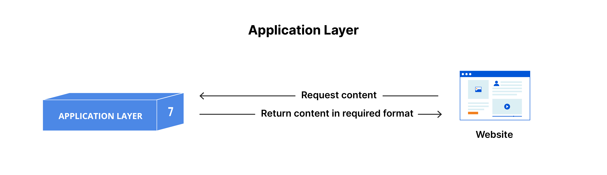
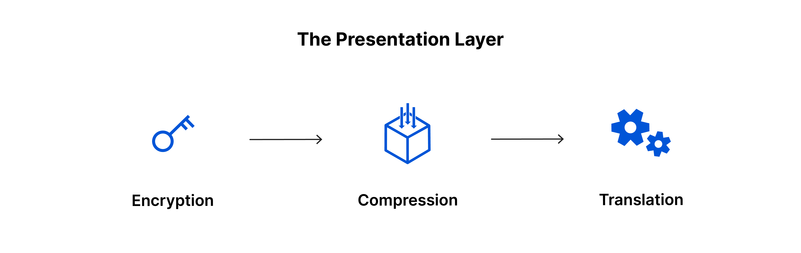
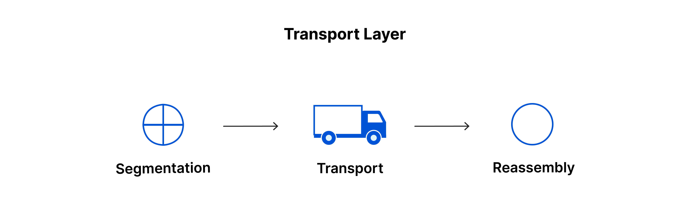
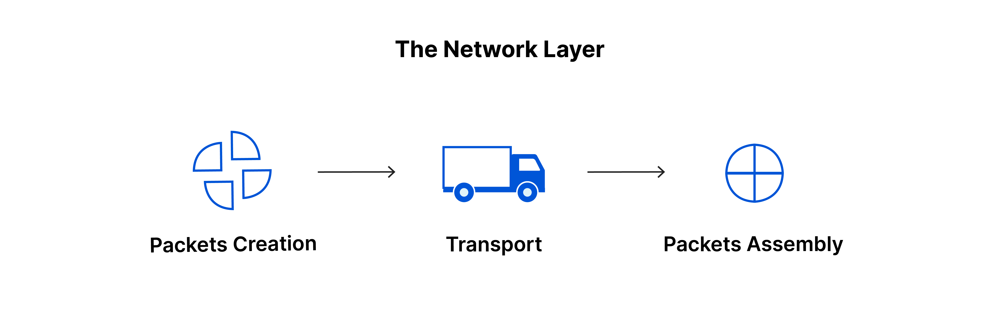
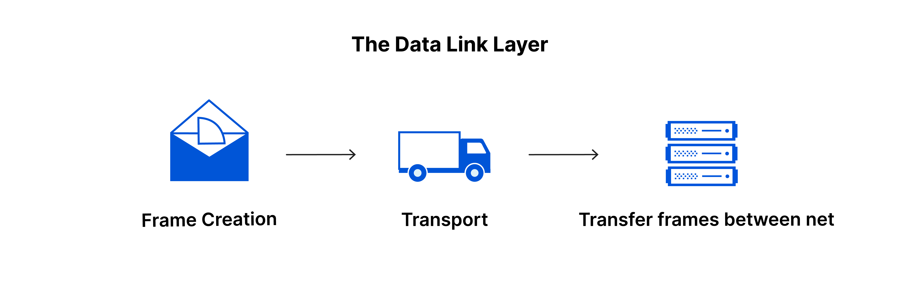
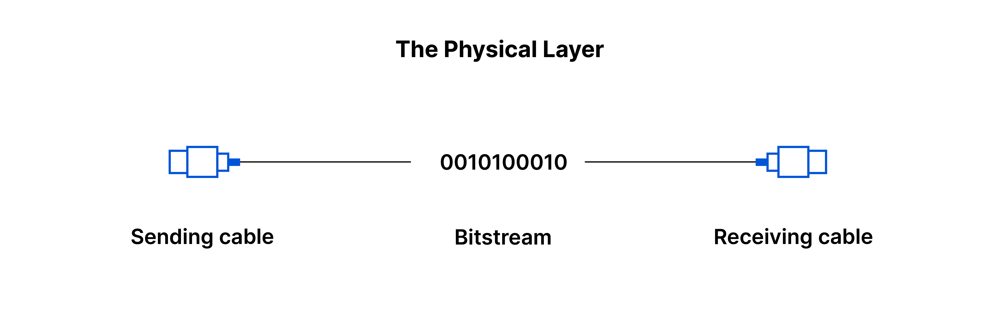

# OSI 모델이란?
- **네트워크 통신 기능을 7개의 계층으로 나누는 개념적 프레임워크**
- **상이한 컴퓨터 시스템이 서로 통신할 수 있는 표준을 제공**

 

## OSI 모델의 7가지 계층
### 7. 애플리케이션 계층
- 사용자의 데이터와 직접 상호 작용하는 유일한 계층
- 소프트웨어가 사용자에게 의미 있는 데이터를 제공하기 위해 의존하는 프로토콜과 데이터를 조작하는 역할
- **프로토콜 :** HTTP, SMTP(이메일 통신을 가능하게 하는 프로토콜)

 

### 6. 프레젠테이션 계층
- 애플리케이션 계층이 소비할 수 있도록 데이터를 프레젠테이션
- 데이터의 변환, 암호화, 압축을 담당

 

### 5. 세션 계층
- 두 기기 사이의 통신을 시작하고 종료하는 일을 담당하는 계층
- 데이터 전송을 체크포인트와 동기화

 

### 4. 전송 계층
- 두 기기 간의 종단 간 통신
- 흐름 제어 및 오류 제어 기능의 역할
- **프로토콜 :** TCP(전송 제어 프로토콜), UDP(사용자 데이터그램 프로토콜)

 

### 3. 네트워크 계층
- 서로 다른 두 네트워크 간 데이터 전송을 용이하게 하는 역할
- 데이터가 표적에 도달하기 위한 최상의 물리적 경로를 찾는데 이를 라우팅이라 한다.
- **프로토콜 :** IP, ICMP, IGMP, IPsec

 

### 2. 데이터 링크 계층
- 동일한 네트워크에 있는 두 개의 장치 간 데이터 전송을 용이하게 한다.
- 인트라 네트워크 통신에서 흐름 제어 및 오류 제어를 담당

 

### 1. 물리적 계층
- 케이블, 스위치 등 데이터 전송과 관련된 물리적 장비가 포함
- 1과 0의 문자열인 비트 스트림으로 변환되는 계층

 

## OSI 계층 통신하는 법
네트워크를 통해 사람이 읽을 수 있는 정보를 장치 간에 전송하려면 데이터가 송신 장치에서 OSI 모델의 7가지 계층 아래로 이동한 다음 최종 수신자에서 7가지 계층 위로 이동해야 합니다.