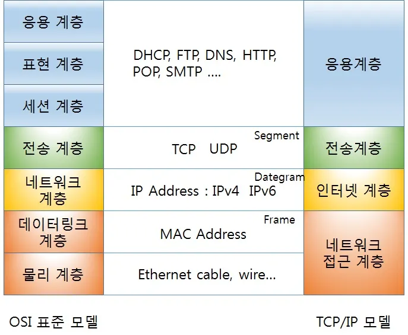
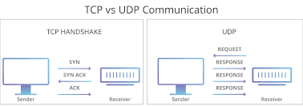

# 📚 TCP/IP 모델이란?
- **컴퓨터와 네트워크가 데이터를 주고받는 기본 프로토콜**
- **인터넷을 포함한 대부분의 네트워크에서 사용**
- **IP: 데이터 전송 경로 지정, TCP: 안정적인 데이터 전송 담당**
- **이메일, 파일 전송, 원격 로그인 등 주요 네트워크 기능 지원**
- **하드웨어나 운영체제에 상관없이 작동하는 유연한 구조**

 

## 📖 TCP/IP 4계층 모델

### 1. 네트워크 접근 계층
- **데이터 단위:** 프레임  
- **전송 주소:** MAC 주소  
- **역할:**  
  - 데이터를 실제 네트워크를 통해 전송하는 물리적 기능 수행  
  - 다른 컴퓨터로 데이터를 직접 송신 및 수신  
- **대표 프로토콜:** Ethernet, Wi-Fi, PPP  

### 2. 인터넷 계층
- **데이터 단위:** 패킷  
- **전송 주소:** IP 주소  
- **역할:**  
  - 패킷을 출발지에서 목적지로 전달  
  - 라우팅, 주소 지정, 패킷 포워딩 수행  
- **대표 프로토콜:** IP, ICMP, ARP  

### 3. 전송 계층
- **데이터 단위:** 세그먼트  
- **전송 주소:** 포트 번호  
- **역할:**  
  - 애플리케이션 간 논리적 통신 제공  
  - 데이터의 정확한 전송을 보장 (흐름 제어, 오류 제어, 혼잡 제어 수행)  
- **대표 프로토콜:** TCP, UDP  

### 4. 응용 계층
- **데이터 단위:** 데이터/메시지  
- **역할:**  
  - 사용자와 네트워크 간의 인터페이스 제공  
  - 암호화, 사용자 인증 등의 보안 기능 수행  
  - 애플리케이션이 네트워크를 통해 데이터를 송수신할 수 있도록 지원  
- **대표 프로토콜:** HTTP, FTP, SMTP, DNS, Telnet  

## 📖 TCP 통신
> 한 컴퓨터에서 다른 컴퓨터로 전송되는 모든 데이터가 오류나 결함 없이 올바른 순서로 성공적으로 수신되도록 하기 위한 것

### 통신 방식
1. 한 컴퓨터(발신자)가 수신 컴퓨터에게 초기 메시지를 보내 연결 설정을 공식적으로 요청합니다. 이를 SYN 메시지(동기화의 줄임말)라고 합니다.
2. 그런 다음 수신 컴퓨터는 SYN에 대한 승인(SYN-ACK 메시지라고 함)을 보내야 합니다. 
3. 마지막으로 발신자가 확인을 승인해야 합니다(수신 확인 메시지라고 함).

 

## 📖 UDP 통신
> 한 컴퓨터에서 다른 컴퓨터로 전송되는 모든 데이터를 빠르게 전달하지만, 오류 검출이나 순서 보장 없이 수신하도록 하기 위한 것

### 통신 방식
1. 발신 컴퓨터가 데이터를 바로 전송합니다. 연결을 설정하는 과정이 없습니다.  
2. 수신 컴퓨터는 데이터를 받지만, 이를 확인하거나 순서를 보장하지 않습니다.  
3. 발신 컴퓨터는 수신 확인을 기다리지 않고 계속해서 데이터를 전송합니다.  

## 💭 면접 예상 질문
 ❓ 질문 | ✅ 답변 |
|--------|--------|
| **TCP/IP 모델과 OSI 모델의 차이점은 무엇인가요?** | TCP/IP 모델은 실제 네트워크에서 사용되는 4계층 구조로, 인터넷 통신을 중심으로 설계되었습니다. 반면, OSI 모델은 7계층 구조로 개념적이고 표준화된 네트워크 모델이며, 이론적인 프레임워크로 많이 활용됩니다. |
| **TCP 3-way handshake 과정과 목적을 설명해주세요.** | 신뢰성 있는 연결을 설정하기 위한 과정입니다. 먼저 클라이언트가 서버에 연결 요청(SYN)을 보내고, 서버가 이를 수락(SYN-ACK)한 후, 클라이언트가 확인 응답(ACK)을 보내면서 연결이 확립됩니다. |
| **TCP 4-way handshake(연결 종료 과정)는 어떻게 이루어지나요?** | TCP 4-way handshake는 안전한 연결 종료를 위한 과정입니다. 클라이언트가 종료 요청(FIN)을 보내면, 서버가 이를 확인(ACK)한 후, 서버도 종료 요청(FIN)을 보내고, 클라이언트가 마지막으로 확인 응답(ACK)을 보내면서 연결이 종료됩니다. |
| **TCP와 UDP의 차이점을 설명해주세요.** | TCP는 신뢰성 있는 데이터 전송을 보장하지만 속도가 상대적으로 느립니다. 반면, UDP는 빠른 데이터 전송이 가능하지만, 데이터 손실이나 순서 보장이 없습니다. TCP는 웹 브라우징, 이메일, 파일 전송 등에 사용되며, UDP는 실시간 스트리밍, 온라인 게임, VoIP 같은 서비스에 적합합니다. |