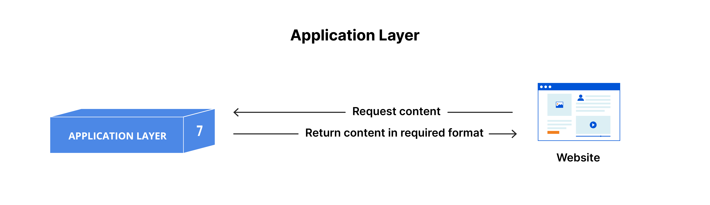
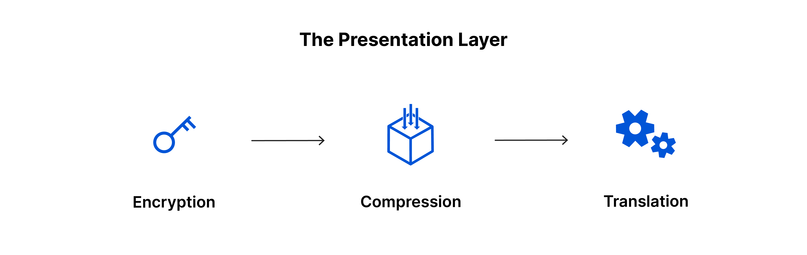
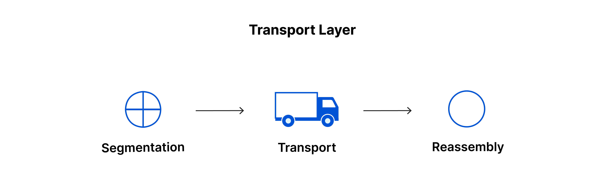
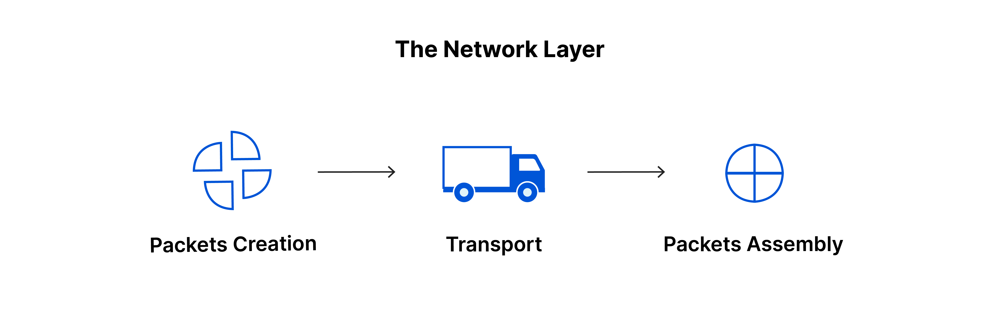
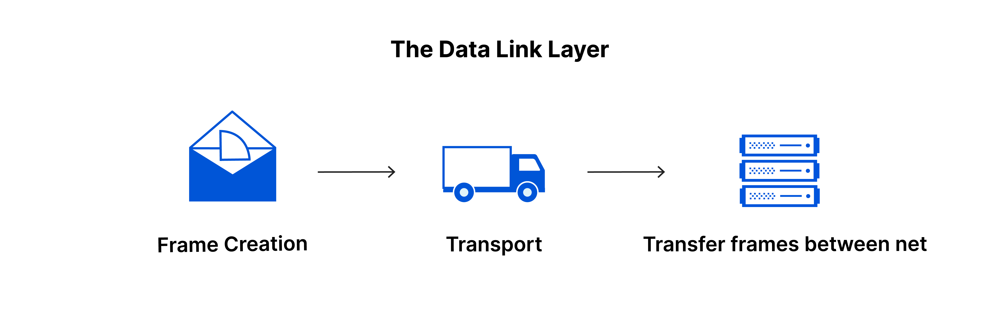
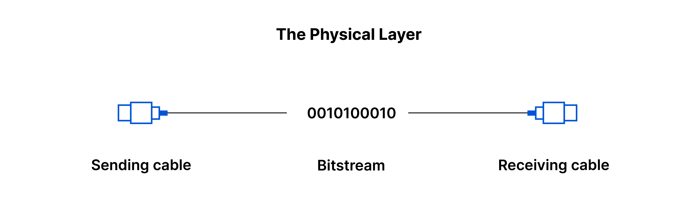

# OSI 모델이란?
- **네트워크 통신 기능을 7개 계층으로 나눈 개념적 프레임워크**
- **서로 다른 컴퓨터 시스템이 원활하게 통신할 수 있도록 표준을 제공**

 

## OSI 모델의 7계층

### 7. 애플리케이션 계층
- 사용자 데이터와 직접 상호 작용하는 유일한 계층
- 소프트웨어가 사용자에게 의미 있는 데이터를 제공하기 위해 사용하는 프로토콜과 데이터 처리 담당
- **프로토콜:** HTTP, SMTP(이메일 통신 프로토콜)

 

### 6. 프레젠테이션 계층
- 애플리케이션 계층이 데이터를 이해할 수 있도록 변환하는 역할
- 데이터의 변환, 암호화, 압축을 담당

 

### 5. 세션 계층
- 두 기기 간의 통신 세션을 설정, 유지 및 종료하는 역할
- 데이터 전송 중 체크포인트 설정 및 동기화 수행

 

### 4. 전송 계층
- 두 기기 간 종단 간(end-to-end) 통신을 담당
- 흐름 제어 및 오류 제어 기능 포함
- **프로토콜:** TCP(전송 제어 프로토콜), UDP(사용자 데이터그램 프로토콜)

 

### 3. 네트워크 계층
- 서로 다른 네트워크 간 데이터 전송을 가능하게 함
- 최적의 경로를 찾아 데이터 패킷을 목적지까지 전달 (라우팅)
- **프로토콜:** IP, ICMP, IGMP, IPsec

 

### 2. 데이터 링크 계층
- 동일한 네트워크 내 두 장치 간 데이터 전송을 담당
- 인트라 네트워크 통신에서 흐름 제어 및 오류 제어 기능 수행

 

### 1. 물리적 계층
- 케이블, 스위치 등 데이터 전송과 관련된 물리적 장비 포함
- 데이터를 0과 1의 비트 스트림으로 변환

 

## OSI 계층의 통신 방식
네트워크를 통해 사람이 읽을 수 있는 정보를 전송하려면, 데이터는 송신 장치에서 OSI 모델의 7개 계층을 거쳐 내려가며 변환된 후, 수신 장치에서 다시 7개 계층을 거쳐 올라와야 한다.
