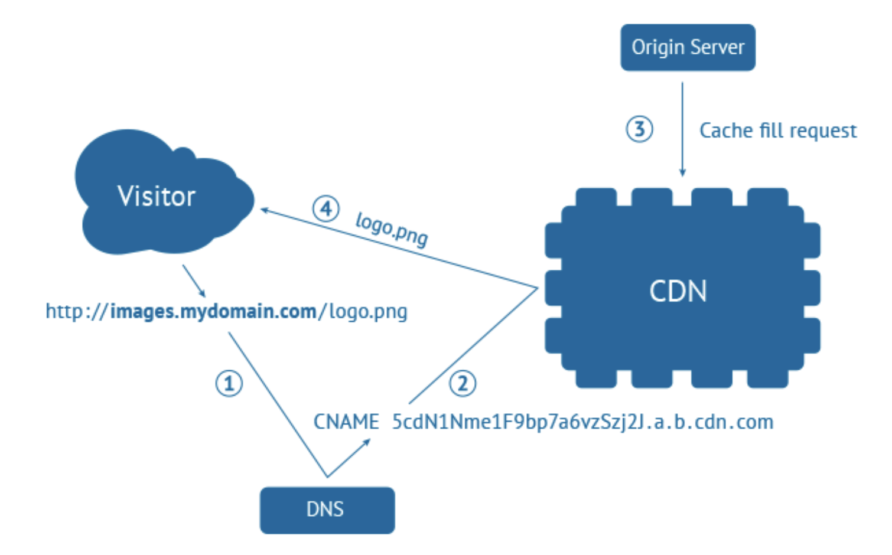
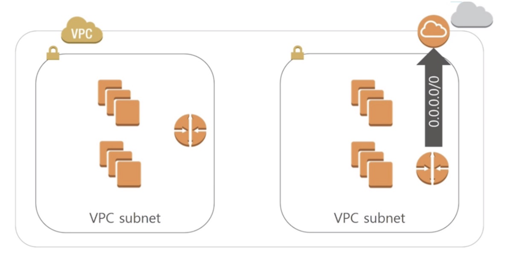
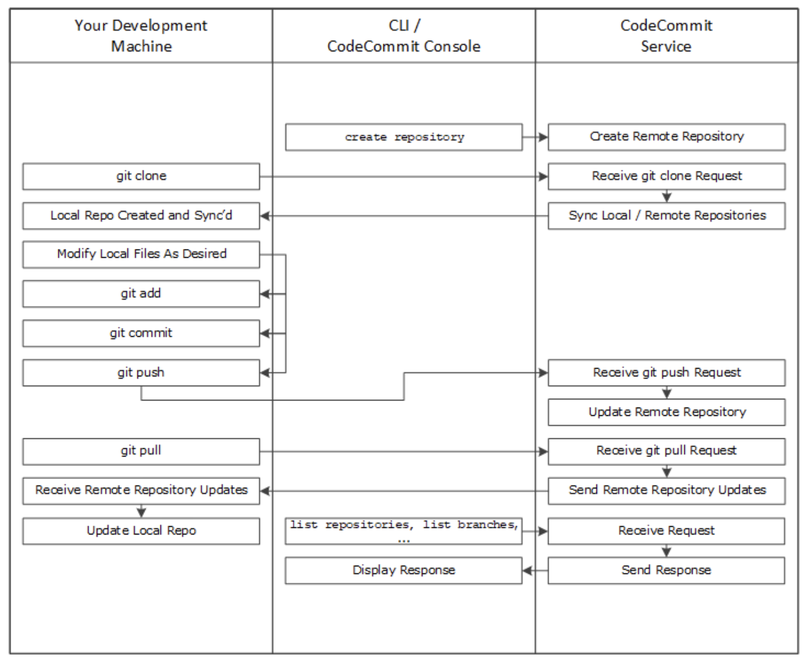

# 📚 AWS 정리 문서

## 📖 클라우드 서비스 개요

### AWS란?
- AWS는 전 세계에 분포한 데이터 센터에서 200개 이상의 완전한 기능을 갖춘 서비스를 제공하는 세계에서 가장 널리 채택된 클라우드 플랫폼이다.
- 빠르게 성장하는 스타트업, 대기업, 정부 기관 등 수백만 고객이 AWS를 통해 비용을 절감하고 민첩성을 높이며 빠르게 혁신하고 있다.

### 클라우드 컴퓨팅이란?
- IT 리소스를 인터넷을 통해 온디맨드 방식으로 제공하고, 사용한 만큼 비용을 지불하는 모델이다.
- 물리적 서버를 직접 구매 및 유지 관리하는 대신, 클라우드 공급자로부터 컴퓨팅, 스토리지, 데이터베이스 등 필요한 자원을 즉시 사용할 수 있다.

### 클라우드 컴퓨팅의 이점
- 민첩성
- 탄력성
- 비용 절감
- 온디맨드 사용
- 관리 용이성

### 클라우드 유형

#### 주요 클라우드 서비스 제공업체
- AWS
- Microsoft Azure
- Google Cloud Platform (GCP)
- Oracle Cloud Infrastructure (OCI)
- Naver Cloud

---

## 📖 AWS 기본 개념

### AWS 용어 정리

- **가상화**  
  - 물리적 하드웨어 자원을 효율적으로 활용할 수 있게 해주는 기술로, 클라우드 컴퓨팅의 핵심 기반이 된다.

- **가상 머신 (VM)**  
  - 물리적 컴퓨팅 환경을 소프트웨어로 시뮬레이션한 가상 환경이다. 구성 파일, 가상 디스크, 스냅샷 등으로 구성된다.

- **스냅샷**  
  - 파일 시스템을 특정 시점에 캡처하여 저장하는 기술이다. 백업과는 다르게 초기 생성 시에는 공간을 거의 차지하지 않는다.

- **Region**  
  - AWS 리소스가 배포되는 물리적 지역이다. 사용자는 애플리케이션과 데이터가 배포될 리전을 선택할 수 있다.

- **Availability Zone (AZ)**  
  - 하나의 리전은 2개 이상의 가용 영역으로 구성되며, 고가용성을 위한 물리적 분산 인프라 단위이다.

---

## 📖 컴퓨팅 서비스

### EC2 (Elastic Compute Cloud)

#### 주요 기능

- **인스턴스**: 가상 서버 환경을 제공한다.
- **AMI**: 운영체제 및 소프트웨어가 구성된 템플릿이다.
- **인스턴스 유형**: 다양한 스펙 조합(CPU, RAM 등)을 제공한다.
- **키 페어**: 보안 접속을 위한 공개키 기반 인증 수단이다.
- **인스턴스 스토어**: 일시적 데이터 저장소이다. 인스턴스가 중단되거나 종료되면 데이터가 소멸된다.
- **EBS**: 영구적 블록 스토리지로, 인스턴스와 독립적으로 데이터가 유지된다.
- **보안 그룹**: 인스턴스 접근 제어를 위한 가상 방화벽이다.
- **탄력적 IP (EIP)**: 고정된 공용 IP 주소이다.
- **태그**: 리소스를 식별하기 위한 메타데이터이다.
- **VPC**: 격리된 네트워크 환경을 제공한다.

---

### Elastic Beanstalk

- 인프라 지식 없이도 애플리케이션을 손쉽게 배포하고 운영할 수 있게 한다.
- 업로드만 하면, 용량 프로비저닝, 로드 밸런싱, 오토 스케일링 등을 자동 처리한다.
- 지원 언어: Go, Java, .NET, Node.js, PHP, Python, Ruby 등

---

## 📖 데이터베이스 서비스

### SQL vs NoSQL

---

### RDS (Relational Database Service)

- 클라우드에서 실행되는 관리형 데이터베이스 인스턴스이다.
- 서버리스는 아니며, 직접 로그인은 불가능하다.
- 콘솔, CLI, API를 통해 인스턴스를 생성하고 관리할 수 있다.

---

### DocumentDB

- MongoDB API 호환 문서형 DB이다.
- 스토리지와 컴퓨팅이 분리되며, 고성능 읽기 복제본 최대 15개까지 지원한다.
- JSON 데이터 구조를 기반으로 하며 유연한 인덱싱을 제공한다.
- 고가용성과 복원력을 위한 3개 AZ에 6개 복제본을 유지한다.

---

### MongoDB

- Document 기반의 NoSQL DB이다.
- 스키마 유연성 덕분에 다양한 애플리케이션 요구에 대응할 수 있다.
- 자체적으로 분산 시스템을 제공하며, 확장 시 애플리케이션 수정이 필요 없다.

---

### DynamoDB

- 완전관리형 Key-Value NoSQL DB이다.
- Auto-Scaling과 데이터 암호화를 지원한다.
- 백업, 모니터링, 무제한 확장을 지원하며 스키마 정의가 필요 없다.
- 테이블 생성 시 Key만 정의하고 나머지 속성은 유연하게 추가할 수 있다.

  
  

---

### DocumentDB vs DynamoDB

- 공통점:
  - NoSQL 기반
  - 암호화 및 감사 로그 지원
  - AWS DMS를 통한 마이그레이션 지원

| 항목 | DocumentDB | DynamoDB |
|:--|:--|:--|
| 비용 | 최소 월 200$ | 최소 월 1$ (25GB 무료) |
| 리전 지원 | 일부 리전 한정 | 글로벌 지원 |
| 백업 | 자동 일일 백업 제공 | 수동 백업 또는 온디맨드 |

  
  

---

## 📖 네트워크 및 보안

### Route53

- 고가용성과 확장성을 제공하는 DNS 웹 서비스이다.
- 도메인 등록, DNS 라우팅, 상태 확인 기능을 제공한다.

- Public/Private 호스트 존을 지원한다.
- DNS + 모니터링 + 로드 밸런싱 + 글로벌 서버 로드 밸런싱(GSLB) 기능을 포함한다.

---

### Certificate Manager (ACM)

- AWS에서 SSL/TLS 인증서를 자동으로 관리하고 배포할 수 있게 해준다.
- 도메인 소유권 검증 방식은 DNS 또는 이메일 기반이다.

#### 특징
- 무료 퍼블릭 인증서 제공
- 자동 갱신 지원
- 인증서 쉽게 발급

---

### CloudFront

- 글로벌 CDN 서비스로 성능, 보안, 비용 측면에서 최적화된 콘텐츠 전송을 지원한다.
- 정적/동적 콘텐츠 모두 캐싱하여 로드 속도를 높인다.

  
  

---

### ELB (Elastic Load Balancing)

- 네트워크 트래픽을 여러 인스턴스로 분산시켜 가용성과 확장성을 높인다.

  
  

---

### VPC (Virtual Private Cloud)

- 사용자 정의 가상 네트워크이다. 온프레미스 환경과 유사하게 구성할 수 있다.

#### 주요 기능
- 서브넷, IP 주소 지정, 라우팅 테이블
- 인터넷 게이트웨이, NAT, VPC 엔드포인트
- VPC 피어링, 트래픽 미러링, Transit Gateway
- 흐름 로그, VPN 연결

- 사용 가능한 Private IP 대역:
  - 10.0.0.0 ~ 10.255.255.255
  - 172.16.0.0 ~ 172.31.255.255
  - 192.168.0.0 ~ 192.168.255.255

  
  

---

#### CIDR
- Classless Inter-Domain Routing: IP 주소 범위를 효율적으로 지정하는 방식이다.

---

## 📖 IAM

### IAM

- AWS 리소스에 대한 액세스를 안전하게 제어할 수 있는 웹 서비스이다.
- IAM을 사용하면 리소스를 사용하도록 인증(로그인) 및 권한 부여(사용 권한 있음)된 대상을 관리할 수 있다.
- 일상적인 작업에서는 루트 사용자 대신 IAM 사용자를 사용할 것을 권장한다.

### IAM 특징

- 여러 사용자와 계정 공유를 지원한다.
- 리소스에 대해 세분화된 권한을 설정할 수 있다.
- Amazon EC2에서 실행되는 애플리케이션이 IAM 역할을 통해 AWS 리소스에 안전하게 액세스할 수 있다.
- 멀티 팩터 인증(MFA)을 지원해 보안을 강화할 수 있다.

### IAM 정책

- IAM 정책은 JSON 형식으로 작성되며, AWS 리소스에 대한 접근 권한을 정의한다.
- 관리형 정책(Managed Policy)과 인라인 정책(Inline Policy) 두 가지 방식으로 제공된다.
  - 관리형 정책은 AWS 또는 사용자가 생성하여 여러 엔터티(사용자, 그룹, 역할)와 재사용할 수 있다.
  - 인라인 정책은 특정 엔터티에 직접 연결되어 해당 엔터티 전용으로 사용된다.

  
  

---

## 📖 S3

### S3

- 업계 최고의 확장성, 데이터 가용성, 보안 및 성능을 제공하는 객체 스토리지 서비스이다.
- 모든 규모와 업종의 고객은 Amazon S3를 사용해 데이터 레이크, 웹 사이트, 모바일 애플리케이션, 백업 및 복원, 아카이브, 엔터프라이즈 애플리케이션, IoT 디바이스, 빅 데이터 분석 등 다양한 사용 사례를 지원할 수 있다.
- Amazon S3는 특정 비즈니스, 조직, 규정 준수 요구 사항에 맞춰 데이터에 대한 액세스를 최적화, 구조화, 구성할 수 있는 다양한 관리 기능을 제공한다.

### S3 기능

- 다양한 스토리지 클래스 제공
- 스토리지 관리 기능 제공
- 액세스 관리 기능 제공
- 데이터 처리 기능 제공
- 스토리지 로깅 및 모니터링 지원
- 분석 및 인사이트 기능 제공
- 강력한 읽기/쓰기 일관성 제공

### Amazon S3를 사용하여 정적 웹 사이트 호스팅

- 정적 웹 사이트는 개별 웹 페이지에 정적 콘텐츠를 포함하고 있으며, 클라이언트 측 스크립트(JavaScript 등)를 사용할 수도 있다.
- 동적 웹 사이트와는 달리 서버 측 처리(PHP, JSP, ASP.NET 등)에 의존하지 않는다.

---

## 📖 CI/CD

### CI/CD

- **지속적 통합(CI)**: 모든 개발자가 작성한 코드를 하루에도 여러 번 공유 리포지토리에 커밋하고 병합하는 과정이다. 이를 통해 빠르게 통합 오류를 발견하고 해결할 수 있다.
- **지속적 전달(CD)**: 개발팀이 짧은 주기로 소프트웨어를 개발하고, 언제든지 운영 환경으로 안정적으로 배포할 수 있도록 지원하는 프로세스이다.

---

### CodeCommit

- 클라우드 환경에서 코드를 안전하게 비공개로 저장하고 관리할 수 있는 버전 관리 서비스이다.
- AWS에서 호스팅되는 완전관리형 Git 기반 저장소를 제공한다.

#### CodeCommit 특징

- AWS가 호스팅하는 완전관리형 Git 저장소를 제공한다.
- 코드를 안전하게 저장하고 협업할 수 있다.
- Git 기반으로 기존 도구와의 호환성이 뛰어나다.
- 대규모 프로젝트에 맞게 손쉽게 확장 가능하다.
- 다른 원격 저장소에서 파일을 쉽게 마이그레이션할 수 있다.
- AWS 및 타사 서비스와 쉽게 통합할 수 있다.
- 저장소에 어떤 파일이든, 언제든지 저장 가능하다.

---

### CodeBuild

- 소스 코드를 컴파일하고, 테스트를 실행하며, 배포 가능한 아티팩트를 생성하는 클라우드 기반 완전관리형 빌드 서비스이다.
- 자체 빌드 서버를 따로 구성하거나 관리할 필요 없이 빌드 환경을 자동으로 확장하고 운영할 수 있다.

#### 특징

- Apache Maven, Gradle 등 널리 사용되는 빌드 도구와 언어를 위한 사전 구성된 빌드 환경을 제공한다.
- 사용자 정의 빌드 환경도 설정 가능하여 고유한 빌드 도구 사용이 가능하다.
- 빌드 요청량에 따라 자동으로 확장된다.

  
  

---

### CodeDeploy

- Amazon EC2, 온프레미스 서버, AWS Lambda 함수, Amazon ECS 서비스 등에 애플리케이션을 자동으로 배포할 수 있도록 지원하는 배포 서비스이다.

#### 배포 가능한 콘텐츠 예시

- 애플리케이션 코드
- 서버리스 Lambda 함수
- 웹 및 구성 파일
- 실행 파일(Executables)
- 패키지, 스크립트, 멀티미디어 파일 등

CodeDeploy는 Amazon S3, GitHub, Bitbucket 등에 저장된 콘텐츠를 대상 서버 또는 리소스에 배포할 수 있다.  
Lambda 함수도 배포 가능하며, 이를 위해 기존 코드를 수정할 필요는 없다.

---

### CodePipeline

- 애플리케이션 및 인프라의 릴리스를 자동화하여 빠르고 안정적인 배포를 지원하는 완전관리형 지속적 전달(CD) 서비스이다.

#### CodePipeline 특징

- 소프트웨어 릴리스 프로세스를 시각적으로 모델링할 수 있다.
- 별도의 서버를 구성하거나 프로비저닝할 필요 없이 사용할 수 있다.
- AWS Management Console 또는 CLI를 통해 릴리스 단계 정의가 가능하다.
- 코드 변경마다 테스트 및 피드백을 반복 수행하여 빠르게 기능을 릴리스할 수 있다.
- 각 단계는 자체 플러그인 또는 AWS 제공 플러그인을 통해 유연하게 구성할 수 있다.
