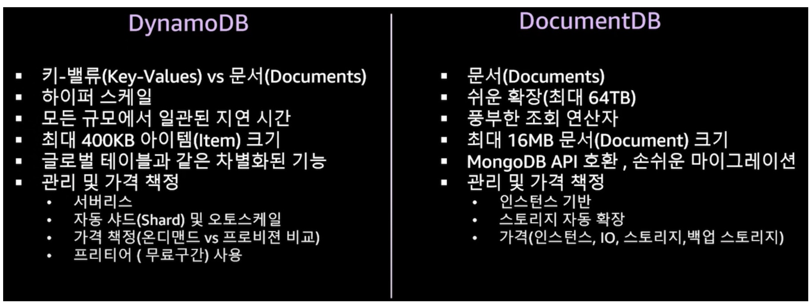
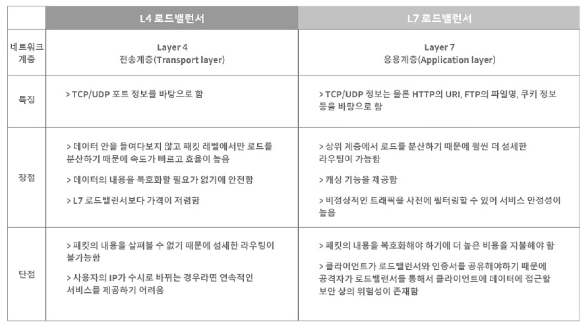

# 📚 AWS 정리 문서

## 📖 클라우드 서비스 개요

### AWS란?
- AWS는 전 세계에 분포한 데이터 센터에서 200개 이상의 완전한 기능을 갖춘 서비스를 제공하는 세계에서 가장 널리 채택된 클라우드 플랫폼이다.
- 빠르게 성장하는 스타트업, 대기업, 정부 기관 등 수백만 고객이 AWS를 통해 비용을 절감하고 민첩성을 높이며 빠르게 혁신하고 있다.

### 클라우드 컴퓨팅이란?
- IT 리소스를 인터넷을 통해 온디맨드 방식으로 제공하고, 사용한 만큼 비용을 지불하는 모델이다.
- 물리적 서버를 직접 구매 및 유지 관리하는 대신, 클라우드 공급자로부터 컴퓨팅, 스토리지, 데이터베이스 등 필요한 자원을 즉시 사용할 수 있다.

### 클라우드 컴퓨팅의 이점
- 민첩성
- 탄력성
- 비용 절감
- 온디맨드 사용
- 관리 용이성

### 클라우드 유형

---

## 📖 AWS 기본 개념

### AWS 용어 정리

- **가상화**  
  - 물리적 하드웨어 자원을 효율적으로 활용할 수 있게 해주는 기술로, 클라우드 컴퓨팅의 핵심 기반이 된다.

- **가상 머신 (VM)**  
  - 물리적 컴퓨팅 환경을 소프트웨어로 시뮬레이션한 가상 환경이다. 구성 파일, 가상 디스크, 스냅샷 등으로 구성된다.

- **스냅샷**  
  - 파일 시스템을 특정 시점에 캡처하여 저장하는 기술이다. 백업과는 다르게 초기 생성 시에는 공간을 거의 차지하지 않는다.

- **Availability Zone (AZ)**  
  - 하나의 리전은 2개 이상의 가용 영역으로 구성되며, 고가용성을 위한 물리적 분산 인프라 단위이다.

---

## 📖 컴퓨팅 서비스

### EC2 (Elastic Compute Cloud)

#### 주요 기능

- **인스턴스**: 가상 서버 환경을 제공한다.
- **AMI**: 운영체제 및 소프트웨어가 구성된 템플릿이다.
- **인스턴스 유형**: 다양한 스펙 조합(CPU, RAM 등)을 제공한다.
- **키 페어**: 보안 접속을 위한 공개키 기반 인증 수단이다.
- **인스턴스 스토어**: 일시적 데이터 저장소이다.
- **EBS**: 영구적 블록 스토리지이다.
- **보안 그룹**: 인스턴스 접근 제어를 위한 가상 방화벽이다.
- **탄력적 IP (EIP)**: 고정된 공용 IP 주소이다.
- **태그**: 리소스를 식별하기 위한 메타데이터이다.
- **VPC**: 격리된 네트워크 환경을 제공한다.

---

### Elastic Beanstalk

- 인프라 지식 없이도 애플리케이션을 손쉽게 배포하고 운영할 수 있게 한다.
- 업로드만 하면, 용량 프로비저닝, 로드 밸런싱, 오토 스케일링 등을 자동 처리한다.
- 지원 언어: Go, Java, .NET, Node.js, PHP, Python, Ruby 등

---

## 📖 데이터베이스 서비스

### SQL vs NoSQL

---

### RDS (Relational Database Service)

- 클라우드에서 실행되는 관리형 데이터베이스 인스턴스이다.
- 서버리스는 아니며, 직접 로그인은 불가능하다.
- 콘솔, CLI, API를 통해 인스턴스를 생성하고 관리할 수 있다.

---

### DocumentDB

- MongoDB API 호환 문서형 DB이다.
- 스토리지와 컴퓨팅이 분리되며, 고성능 읽기 복제본 최대 15개까지 지원한다.
- JSON 데이터 구조를 기반으로 하며 유연한 인덱싱을 제공한다.
- 고가용성과 복원력을 위한 3개 AZ에 6개 복제본을 유지한다.

---

### MongoDB

- Document 기반의 NoSQL DB이다.
- 스키마 유연성 덕분에 다양한 애플리케이션 요구에 대응할 수 있다.
- 자체적으로 분산 시스템을 제공하며, 확장 시 애플리케이션 수정이 필요 없다.

---

### DynamoDB

- 완전관리형 Key-Value NoSQL DB이다.
- Auto-Scaling과 데이터 암호화를 지원한다.
- 백업, 모니터링, 무제한 확장을 지원하며 스키마 정의가 필요 없다.

  
  

---

### DocumentDB vs DynamoDB

- 공통점:
  - NoSQL 기반
  - 암호화 및 감사 로그 지원
  - AWS DMS를 통한 마이그레이션 지원

  
  

---

## 📖 네트워크 및 보안

### Route53

- 고가용성과 확장성을 제공하는 DNS 웹 서비스이다.
- 도메인 등록, DNS 라우팅, 상태 확인 기능을 제공한다.

- Public/Private 호스트 존을 지원한다.
- DNS + 모니터링 + 로드 밸런싱 + GSLB 기능을 포함한다.

---

### Certificate Manager (ACM)

- AWS에서 SSL/TLS 인증서를 자동으로 관리하고 배포할 수 있게 해준다.
- 도메인 소유권 검증 방식은 DNS 또는 이메일 기반이다.

#### 특징
- 무료 퍼블릭 인증서 제공
- 자동 갱신 지원
- 인증서 쉽게 발급

---

### CloudFront

- 글로벌 CDN 서비스로 성능, 보안, 비용 측면에서 최적화된 콘텐츠 전송을 지원한다.
- 정적/동적 콘텐츠 모두 캐싱하여 로드 속도를 높인다.

  
  

---

### ELB (Elastic Load Balancing)

- 네트워크 트래픽을 여러 인스턴스로 분산시켜 가용성과 확장성을 높인다.

  
  

- 대상 그룹을 통해 트래픽 전달 대상과 포트를 제어할 수 있다.

---

### VPC (Virtual Private Cloud)

- 사용자 정의 가상 네트워크이다. 온프레미스 환경과 유사하게 구성할 수 있다.

#### 주요 기능
- 서브넷, IP 주소 지정, 라우팅 테이블
- 인터넷 게이트웨이, NAT, VPC 엔드포인트
- VPC 피어링, 트래픽 미러링, Transit Gateway
- 흐름 로그, VPN 연결

  
  

---

#### CIDR
- Classless Inter-Domain Routing: IP 주소 범위 표현 방식이다.
