# 📚 SQL과 데이터베이스 기초 및 실전

## 📖 데이터 직군과 SQL의 중요성

### 데이터 관련 직군 소개

- **데이터 엔지니어**  
  - Python, Java/Scala  
  - SQL 및 데이터베이스  
  - ETL/ELT(Airflow, DBT), Spark, Hadoop 등 분산 처리 시스템  

- **데이터 분석가**  
  - SQL, 비즈니스 도메인  
  - 통계 분석 (A/B 테스트 등)  

- **데이터 과학자**  
  - 머신러닝, Python, SQL  
  - 통계  

> **데이터 요약 및 분석을 위해 SQL은 필수이다.**

---

## 📖 관계형 데이터베이스 개요

### 정의 및 구조

- 관계형 데이터베이스는 구조화된 데이터를 저장하고 질의할 수 있도록 해주는 스토리지 시스템이다.
- 테이블 기반 구조이며, SQL을 통해 데이터 생성 및 조작이 가능하다.
- 주로 DDL(정의), DML(조작) 언어로 데이터베이스를 다룬다.

### 종류

- **프로덕션 데이터베이스 (OLTP)**  
  - 예: MySQL, PostgreSQL  
  - 서비스 운영에 필요한 빠른 읽기/쓰기 처리에 집중한다.

- **데이터 웨어하우스 (OLAP)**  
  - 예: Redshift, Snowflake, BigQuery  
  - 대규모 데이터 분석 및 머신러닝 모델을 위한 저장소이다.  
  - 일반적으로 운영 DB를 복사하여 사용한다.

<div style="display: flex; justify-content: center; gap: 20px;">
  
  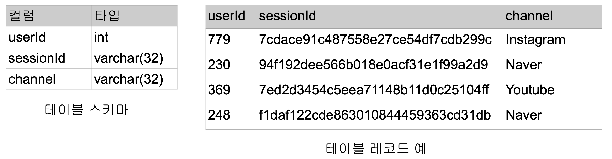
</div>

---

## 📖 SQL이란?

- SQL은 Structured Query Language의 약자로 관계형 데이터베이스에서 데이터를 질의하거나 조작하는 언어이다.
- DDL(테이블 정의), DML(데이터 조작)로 구성된다.

### 데이터베이스 스키마 종류

- **Star Schema**  
  - 서비스 운영 DB에서 사용하는 구조.  
  - 논리적으로 데이터를 나누고 필요한 경우 조인하여 사용한다.  
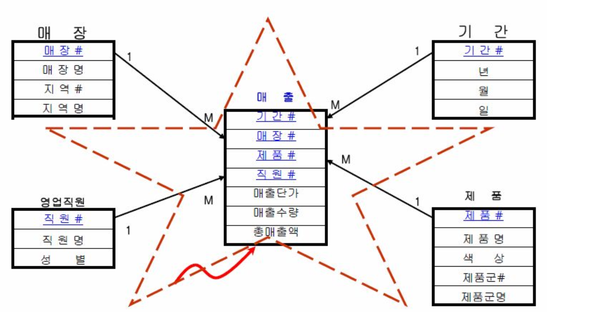

- **Denormalized Schema**  
  - 데이터 웨어하우스에서 주로 사용한다.  
  - 테이블을 조인하지 않고 단일 테이블에 데이터를 저장한다.  
  - 계산 속도가 빠르지만 저장 공간을 더 차지한다.  
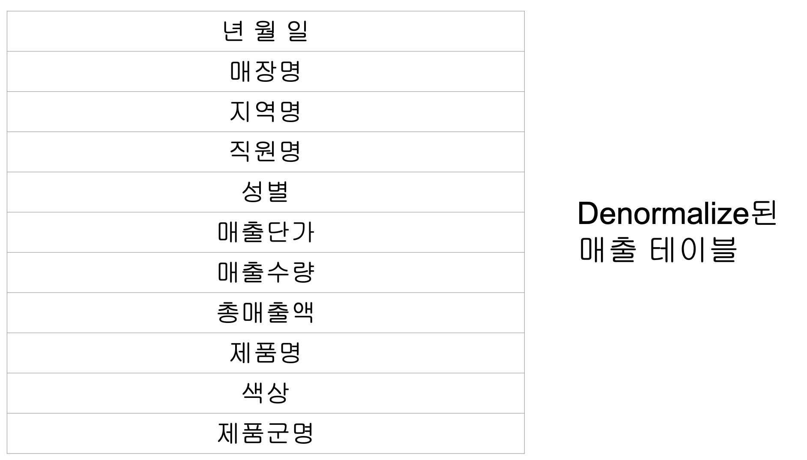


---

## 📖 데이터 웨어하우스

- SQL 기반이지만, OLTP와는 다른 목적을 가진 OLAP 시스템이다.
- 내부 직원용 데이터 분석 DB로, 처리량과 확장성이 중요하다.

### 대표 서비스

- AWS Redshift  
- Google BigQuery  
- Snowflake  

<div style="display: flex; justify-content: center; gap: 20px;">
  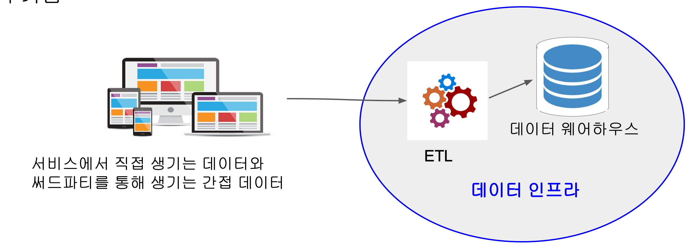
  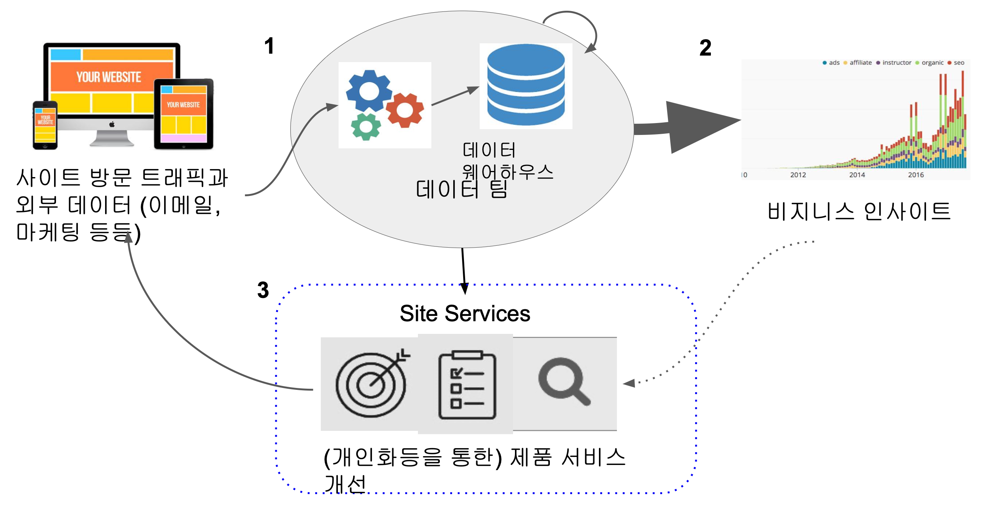
</div>


---

## 📖 Redshift 심화

- 최대 2PB의 데이터를 처리할 수 있는 Column 기반의 OLAP SQL 엔진이다.
- PostgreSQL 8.x 기반이며 대부분의 SQL 구문을 호환한다.

<div style="display: flex; justify-content: center; gap: 20px;">
  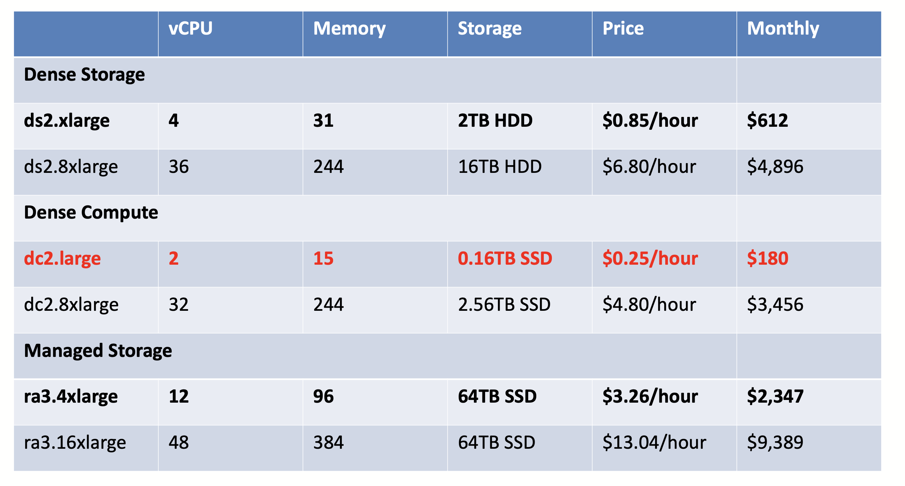
  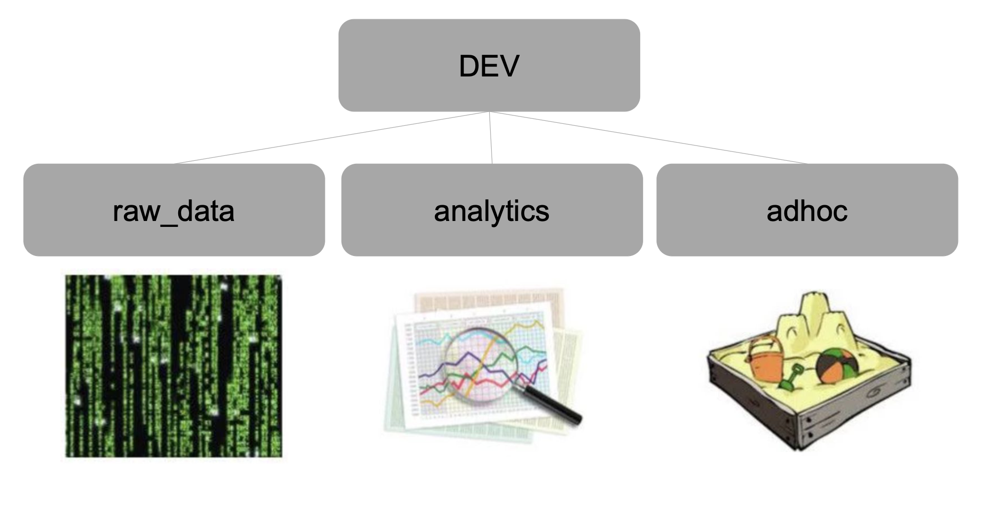
</div>


- PostgreSQL 호환 툴 및 라이브러리(psycopg2 등)를 통해 접근 가능하다.

---

## 📖 SELECT와 기본 SQL

- SELECT 구문은 데이터 조회에 사용되며, 조건 필터링, 정렬, 변환 등이 가능하다.
- COUNT, CASE, NULL 처리 등은 필수적으로 익혀야 할 개념이다.

### 예제 테이블 및 분석 시나리오

<div style="display: flex; justify-content: center; gap: 20px;">
  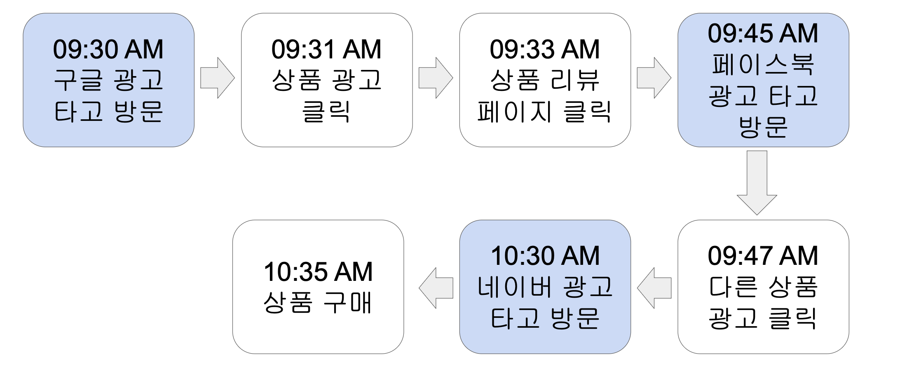
  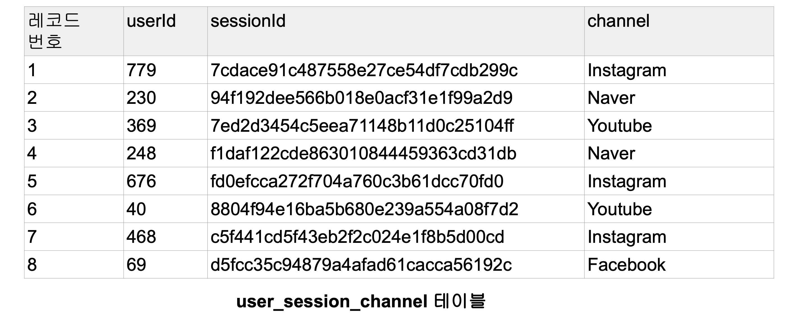
  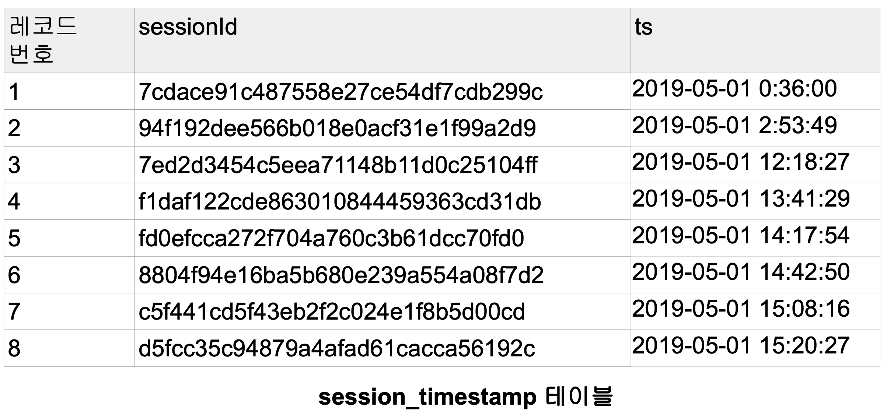
</div>

---

## 📖 SQL DDL / DML 요약

- CREATE, ALTER, DROP, INSERT, UPDATE, DELETE 등 테이블 및 레코드 조작 구문

---

## 📖 GROUP BY와 집계 함수

- 집계 함수: COUNT, SUM, AVG, MAX, MIN, LISTAGG 등
- 월별, 채널별 사용자 분석과 같은 지표 생성에 활용한다.

```sql
SELECT
    TO_CHAR(ts, 'YYYY-MM') AS month,
    COUNT(DISTINCT userid) AS mau
FROM session_data
GROUP BY 1
ORDER BY 1 DESC;
```

---

## 📖 CTAS / CTE / 데이터 품질 체크

- CTAS: `CREATE TABLE ... AS SELECT`  
- CTE: `WITH ... AS (...) SELECT ...`  
- 중복 체크, null 필드, 고유 키 유지 여부 등 품질 검증 SQL 포함

---

## 📖 JOIN 문법과 종류

- INNER, LEFT, FULL, CROSS, SELF JOIN 등 테이블 병합 방식
- 관계를 명확히 이해하고 기본키 제약 조건을 고려하여 JOIN을 수행한다.

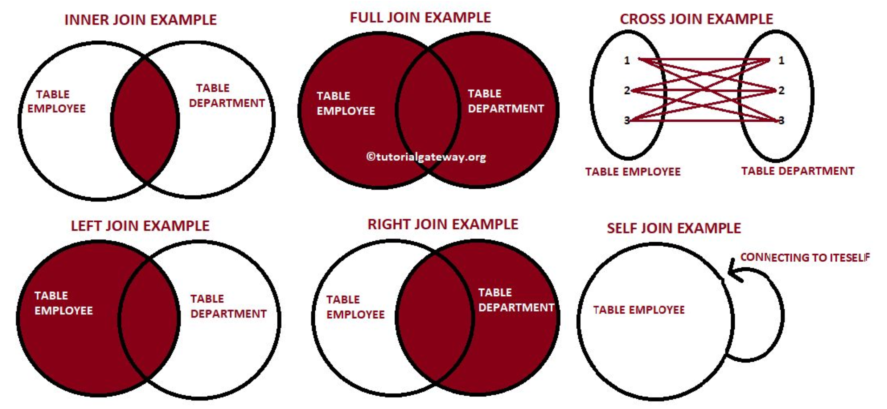
(그 외 JOIN 종류별 이미지도 포함)

---

## 📖 트랜잭션

- BEGIN ~ COMMIT / ROLLBACK  
- Autocommit 모드 제어  
- DELETE vs TRUNCATE 차이 이해 필요

---

## 📖 고급 SQL 문법

- **집합 연산**: UNION, INTERSECT, EXCEPT  
- **NULL 처리 함수**: COALESCE, NULLIF  
- **문자열 처리**: LISTAGG, REPLACE, SUBSTRING 등  
- **윈도우 함수**: ROW_NUMBER, LAG, FIRST_VALUE 등  
- **타입 캐스팅 및 시간 처리 함수**  
- **JSON 파싱 함수**: JSON 데이터 필드 추출 시 사용

---

💡 **실제 데이터와 실습 환경을 바탕으로 직접 쿼리를 작성하고 결과를 검증하는 것이 SQL 실력을 기르는 가장 좋은 방법이다.**
