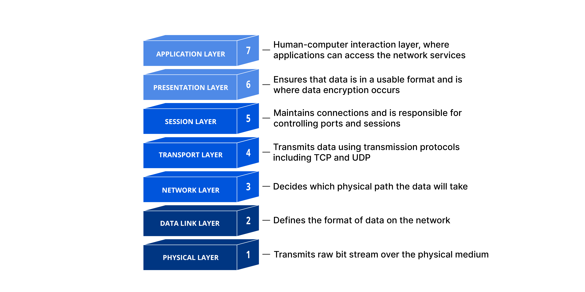
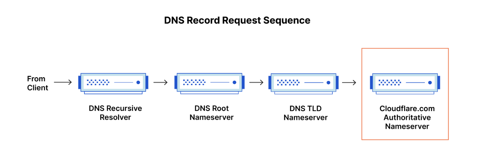
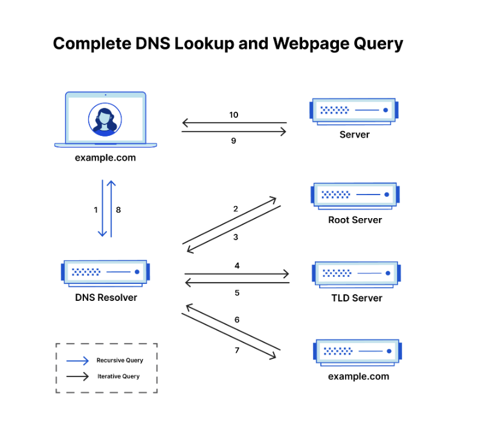

# 📚 네트워크 기본 개념 정리

## 📖 OSI 모델

### OSI 모델이란?
- 네트워크 통신 기능을 7개 계층으로 나눈 개념적 프레임워크이다.  
- 서로 다른 컴퓨터 시스템 간의 원활한 통신을 위한 표준을 제공한다.

### OSI 7계층 상세

1. **물리 계층**  
   - 전기 신호로 데이터를 전송하며 케이블, 허브 등 하드웨어가 포함된다.  
2. **데이터 링크 계층**  
   - 같은 네트워크 내에서 오류 없이 데이터 전송을 수행한다. (MAC 주소 사용)  
3. **네트워크 계층**  
   - 서로 다른 네트워크 간의 경로를 설정하고 라우팅을 담당한다.  
4. **전송 계층**  
   - 종단 간 신뢰성 있는 데이터 전송을 담당한다. (TCP/UDP 사용)  
5. **세션 계층**  
   - 통신 세션을 설정하고 동기화 및 유지 관리를 한다.  
6. **프레젠테이션 계층**  
   - 데이터를 암호화하거나 압축하여 애플리케이션이 이해할 수 있는 형태로 변환한다.  
7. **애플리케이션 계층**  
   - 사용자에게 네트워크 서비스를 제공한다. (HTTP, FTP 등)  

---

## 📖 TCP/IP 모델

### TCP/IP 모델이란?
- 인터넷 및 대부분의 네트워크에서 사용하는 통신 프로토콜의 집합이다.
- 하드웨어, OS와 무관하게 작동하는 유연한 구조를 가진다.

### TCP/IP 4계층

1. **네트워크 접근 계층**: 실제 네트워크를 통해 데이터를 송수신한다. (Ethernet, Wi-Fi)  
2. **인터넷 계층**: 패킷을 목적지까지 전달한다. (IP, ARP, ICMP)  
3. **전송 계층**: 포트를 통해 애플리케이션 간 통신을 지원한다. (TCP, UDP)  
4. **응용 계층**: 사용자와의 인터페이스를 제공한다. (HTTP, DNS, FTP 등)  

---

### TCP 통신 과정 (3-Way Handshake)

1. 클라이언트 → 서버 : SYN  
2. 서버 → 클라이언트 : SYN-ACK  
3. 클라이언트 → 서버 : ACK  

---

### UDP 통신

- 연결 설정 없이 데이터를 빠르게 전송한다.  
- 오류 검출, 순서 보장 없이 전송한다.

---

## 📖 DNS(Domain Name System)

### DNS란?
- 사람이 이해하기 쉬운 도메인명을 IP 주소로 변환하는 시스템이다.  
- 인터넷의 전화번호부와 같은 역할을 수행한다.

---

### DNS 서버 구조

1. **리커서** : 클라이언트 요청을 처음 받는 서버  
2. **루트 서버** : TLD 서버 위치 안내  
3. **TLD 서버** : .com, .net 등 최상위 도메인 관리  
4. **권한 있는 이름 서버** : 실제 IP 정보를 가지고 응답

  
  
  

---

### DNS 조회의 8단계 요약

1. 사용자가 도메인 입력  
2. 재귀 확인자가 루트 서버에 질의  
3. 루트 서버가 TLD 서버 반환  
4. TLD 서버에 질의  
5. 도메인 네임 서버 주소 반환  
6. 해당 네임 서버에 질의  
7. IP 주소 반환  
8. 브라우저가 해당 IP로 접속

---

### DNS 확인자란?

- 클라이언트 요청을 처음 처리하는 DNS 구성 요소  
- 필요한 정보를 얻기 위해 여러 DNS 서버에 순차적으로 쿼리를 보낸다.  
- 캐시된 데이터를 이용하여 응답 속도를 높일 수 있다.

---

### DNS 쿼리 유형

1. **재귀 쿼리**: 클라이언트 대신 최종 IP 주소까지 조회  
2. **반복 쿼리**: 다음 서버 위치만 반환, 클라이언트가 직접 반복 조회  
3. **비재귀 쿼리**: 캐시된 데이터로 즉시 응답

